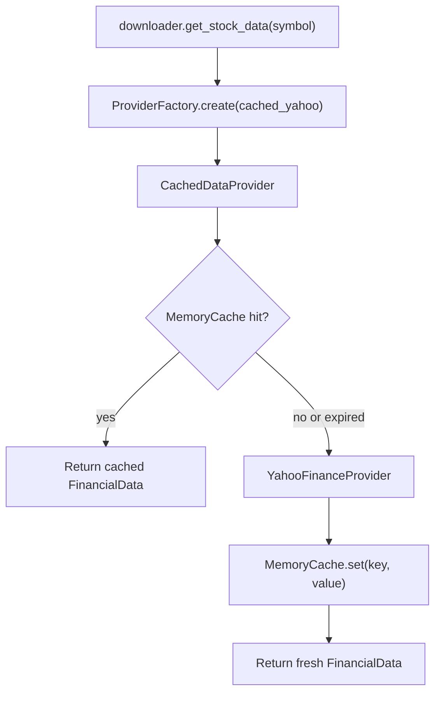

# StockAnalyzerPro

[](https://github.com/zx5875372-source/StockAnalyzerPro/actions/workflows/python-tests.yml)

StockAnalyzerPro is a Python CLI stock analysis project for personal investment research. It focuses on producing a repeatable Markdown report from a fixed investment logic, rather than only fetching market data.

Current version: v2.11 Validation Integration

## Current Features

- Fetches stock and financial data with yfinance.
- Normalizes raw data into FinancialData and FinancialPeriod models.
- Generates a fixed-format Markdown stock analysis report.
- Calculates complete Piotroski F-Score 9 items.
- Calculates SAP Score with a 100-point weighted scoring engine.
- Includes profitability, financial health, cashflow, valuation, and growth analysis.
- Estimates simplified valuation, buy zones, and first target price.
- Shows diagnostics when required financial fields are missing.
- Provides a validation scan over a sample stock universe and exports CSV results.
- Provides an interactive CLI menu for single-stock analysis, watchlist scan, and sample scan.
- Provides a Backtest Engine MVP for historical price validation of SAP Score selections.
- Provides an initial data provider framework for Yahoo Finance, CSV snapshots, and unit-test mocks.
- Provides a formal strategy framework with registry-based SAP Score strategy wiring.
- Provides multiple backtest strategies through `--strategy sap` and `--strategy piotroski`.
- Provides a strategy comparison report for SAP and Piotroski backtests.
- Provides a research report generated from strategy comparison results.
- Provides initial point-in-time historical snapshot dataclasses and SQLite schema definitions.
- Provides a repository layer for storing and querying historical snapshots in SQLite.
- Provides a Snapshot Generator MVP that writes current analyzer proxy SAP Score snapshots into the historical repository.
- Provides a Historical Import Framework for future CSV and external data imports.
- Provides a Historical Validation Framework for validating snapshot metadata, dates, scores, and duplicate keys.

## Installation

Create and activate the Python virtual environment:

```powershell
python -m venv .venv
.venv\Scripts\Activate.ps1
```

Install dependencies:

```powershell
pip install -r requirements.txt
```

## Run

Start the CLI:

```powershell
python app.py
```

Or run directly with the project virtual environment:

```powershell
.venv\Scripts\python.exe app.py
```

Main menu:

- `[1]` Analyze a single stock, for example `2330`.
- `[2]` Scan `data/watchlist.json`.
- `[3]` Scan `tests/sample_data/sample_stocks.json`.
- `[4]` Exit.

Reports are generated in the `reports/` folder.

## Batch Scan

You can run scans from the `app.py` menu, or run `scan.py` directly.

Run the default watchlist scan:

```powershell
.venv\Scripts\python.exe scan.py
```

Run the sample universe scan:

```powershell
.venv\Scripts\python.exe scan.py --sample
```

Run the watchlist scan explicitly:

```powershell
.venv\Scripts\python.exe scan.py --watchlist
```

The sample scan reads:

```text
tests/sample_data/sample_stocks.json
```

The watchlist scan reads:

```text
data/watchlist.json
```

The CSV output is written to:

```text
reports/scan_results.csv
```

The scan result includes SAP Score, Piotroski F-Score, fair price, first target price, diagnostics count, runtime, and per-symbol error messages when analysis fails.

v1.2 scan output also includes:

- `missing_count`: number of missing normalized financial fields.
- `missing_fields`: the missing field names.
- `data_quality_score`: `100 - missing_count * 5`, with a minimum of 0.
- `piotroski_available`: number of Piotroski items that can be calculated.
- `valuation_available`: number of valuation base prices available.
- `growth_available`: number of growth rates available.

The CSV is sorted by SAP Score from high to low, then data quality score from high to low.

The scan also writes a summary report:

```text
reports/scan_summary.md
```

Additional ranking reports:

```text
reports/top10.md
reports/watchlist_report.md
```

Use the summary to review total sample count, success rate, average SAP Score, average data quality score, the stocks with the most missing data, and the top 10 SAP Score stocks. Use the watchlist report to review SAP Score, grade, whether price is below the reasonable buy point, first target price, and data quality for your selected stocks.

## Data Layer

Milestone 3 Sprint 1 adds the initial Provider Framework under:

```text
data_provider/
```

The framework introduces:

- `IDataProvider`: stable provider contract for normalized financial data, price history, universes, and diagnostics.
- `YahooFinanceProvider`: yfinance adapter with access to `info`, `financials`, `balance_sheet`, `cashflow`, and `history`.
- `CSVProvider`: strict CSV reader for SAP Score snapshot CSV files.
- `MockProvider`: deterministic in-memory provider for unit tests.
- `ProviderFactory`: factory for `yahoo`, `yfinance`, `yahoo_finance`, `csv`, and `mock`.

Cache layer design and implementation status:

- `docs/CACHE_LAYER_ARCHITECTURE.md` defines the cache key, TTL, interface, SQLite schema, failure handling, and migration plan.
- `data_provider/cache/` contains the first cache implementation.
- `CacheKey`: canonical key using provider, symbol, data type, period, start date, and end date.
- `CacheEntry`: stores Python object payloads with fetched and expiration metadata.
- `ICache`: storage-agnostic cache contract for `get`, `set`, `exists`, `invalidate`, and `clear`.
- `MemoryCache`: in-memory cache with TTL expiration checks.
- `CachedDataProvider`: wraps any `IDataProvider`, checks cache first, calls the provider only on cache miss or expired cache, then writes successful provider results back to cache.
- `SQLiteCache`: durable cache MVP backed by `cache.db`, with automatic `cache_entries` schema creation, TTL checks, JSON payload storage, and payload hash validation.
- `SQLiteCache` currently supports `dict`, JSON-compatible values, `FinancialData`, and `PriceHistory`. Direct DataFrame payloads are intentionally not supported.
- `SQLiteCache` is implemented but is not connected to `CachedDataProvider` or `ProviderFactory` by default yet.

Cached provider flow:



Current Sprint boundary:

- `modules/downloader.py` now creates `cached_yahoo` through `ProviderFactory`.
- The public downloader API remains `get_stock_data(symbol)`.
- Analyzer is not changed and still receives `FinancialData`.
- App, scan, and analyzer flows continue to call the existing downloader API.
- `cached_yahoo` uses `MemoryCache`, `CachedDataProvider`, and `YahooFinanceProvider`.
- `SQLiteCache` remains available for tests and future integration, but runtime provider flow still uses `MemoryCache`.
- Provider Framework is covered by unit tests and is ready for later integration.

## Strategy Framework

Milestone 4 Sprint 2 adds the formal strategy package under:

```text
strategy/
```

The framework introduces:

- `BaseStrategy`: shared contract for strategy evaluation, ranking, selection, and rebalance behavior.
- `StrategyResult`: normalized strategy output with score, rank, selected flag, reasons, warnings, and metrics.
- `StrategyRegistry`: registry for `register`, `unregister`, `get`, and `list`.
- `SAPScoreStrategy`: current SAP Score backtest selection logic moved into the formal strategy package without changing threshold behavior.
- `PiotroskiStrategy`: selects stocks with Piotroski score >= 7 and data quality score >= 80.

Backtest integration status:

- `BacktestEngine` now depends on `strategy.base_strategy.BaseStrategy`.
- `backtest/strategy.py` remains as a compatibility re-export for existing imports.
- `backtest.py --strategy` supports `sap` and `piotroski`.
- Current SAP Score algorithm and analyzer behavior are unchanged.

## Historical Snapshots

Milestone 5 Sprint 2 adds the initial point-in-time snapshot schema layer under:

```text
historical/
```

The historical layer introduces:

- `FinancialStatementSnapshot`: versioned statement snapshot metadata.
- `SAPScoreSnapshot`: historical SAP / Piotroski score snapshot metadata.
- `SnapshotMetadata`: generation and provenance metadata.
- `HISTORICAL_SNAPSHOT_SCHEMA`: SQLite schema string for `financial_statement_snapshots`, `sap_score_snapshots`, and `snapshot_metadata`.
- `HistoricalSnapshotRepository`: SQLite repository for initializing schema, inserting financial/SAP snapshots, querying snapshots, and listing snapshot dates or symbols.
- `SnapshotGenerator`: runs the current analyzer flow through `scan_stock()`, builds `SAPScoreSnapshot` rows, and writes them to `HistoricalSnapshotRepository`.

Build current-analysis proxy SAP Score snapshots into the repository:

```powershell
.venv\Scripts\python.exe snapshot_repository_builder.py
```

The repository builder reads:

```text
tests/sample_data/sample_stocks.json
```

It writes SAP Score snapshots to:

```text
historical_snapshots.db
```

It also writes a summary report to:

```text
reports/snapshot_repository_summary.md
```

Snapshot Generator MVP fields:

- `snapshot_date`: today's date unless `--snapshot-date` is provided.
- `source`: `current_analysis_proxy`.
- `source_version`: `v0`.
- `is_point_in_time`: `false`.
- `warning`: `not_point_in_time`.

Only `SAPScoreSnapshot` rows are written in this Sprint. `FinancialStatementSnapshot` generation is deferred.

Current boundary:

- No historical data fetching is implemented yet.
- Analyzer, provider, and backtest behavior are unchanged.
- Snapshot Generator MVP uses current analyzer output as a proxy and must not be treated as formal point-in-time data.

## Historical Import Framework

Milestone 5.5 Sprint 1 adds the initial import framework under:

```text
importers/
```

The framework introduces:

- `BaseImporter`: shared importer contract with `supports()`, `import_snapshot()`, `import_financial_statements()`, `name`, and `version`.
- `ImportResult`: normalized import output with imported/skipped/failed counts, imported snapshot objects, and row-level errors.
- `ImporterRegistry`: registry for `register`, `unregister`, `get`, and `list`.
- `MockImporter`: deterministic importer for unit tests.
- `CSVHistoricalImporter`: CSV importer for `FinancialStatementSnapshot` and `SAPScoreSnapshot` rows.

Current import boundary:

- CSV import returns historical snapshot dataclasses and an `ImportResult`.
- CSV import does not write to `HistoricalSnapshotRepository` yet.
- No real historical data provider is called.
- Analyzer, provider, backtest, strategy, SAP Score, Snapshot Generator, and Historical Repository behavior are unchanged.

## Historical Validation Framework

Milestone 5.5 Sprint 2 adds the initial validation framework under:

```text
historical/validation/
```

The framework introduces:

- `HistoricalValidator`: validates `FinancialStatementSnapshot` and `SAPScoreSnapshot` dataclasses.
- `ValidationResult`: normalized validation output with `is_valid`, `errors`, `warnings`, `field_count`, and `missing_fields`.
- `rules.py`: shared validation rules for required fields, ISO dates, fiscal periods, score ranges, credibility grades, point-in-time flags, and duplicate snapshot warnings.

Validation rules currently cover:

- `symbol`
- `snapshot_date`
- `published_date`
- `fiscal_year`
- `fiscal_quarter`
- `sap_score`
- `piotroski_score`
- `data_quality_score`
- `credibility_grade`
- `is_point_in_time`

Current validation boundary:

- Validation runs on in-memory snapshot dataclasses only.
- `CSVHistoricalImporter` validates each CSV row before adding it to `ImportResult`.
- Validation failures are excluded from imported snapshots, increment `failed_count`, and record row-level errors.
- Validation warnings are recorded in `ImportResult.warnings`, but the snapshot is still imported.
- No API calls, repository writes, analyzer changes, SAP Score changes, or backtest behavior changes are included in this Sprint.

## Backtest MVP

Run the Sprint 3 Backtest Engine MVP:

```powershell
.venv\Scripts\python.exe backtest.py
.venv\Scripts\python.exe backtest.py --start 2024-01-01 --end 2025-12-31
.venv\Scripts\python.exe backtest.py --benchmark 006208.TW
.venv\Scripts\python.exe backtest.py --capital 500000
.venv\Scripts\python.exe backtest.py --strategy sap
.venv\Scripts\python.exe backtest.py --strategy piotroski
```

Compare strategies with the same backtest parameters:

```powershell
.venv\Scripts\python.exe strategy_compare.py
.venv\Scripts\python.exe strategy_compare.py --strategies sap piotroski
```

Generate the research report from strategy comparison output:

```powershell
.venv\Scripts\python.exe research_report.py
```

Build generated SAP Score snapshots:

```powershell
.venv\Scripts\python.exe snapshot_builder.py
```

The MVP uses:

- `tests/sample_data/sample_stocks.json` as the universe.
- Historical SAP Score snapshots from `data/snapshots/generated_sap_scores.csv` when available.
- Falls back to `data/snapshots/sample_sap_scores.csv` when generated snapshots do not exist.
- Default benchmark `0050.TW`.
- yfinance historical price data from `2023-01-01` to `2025-12-31`.
- Monthly rebalance.
- Equal-weight positions.
- Initial cash of `1000000`.

Outputs:

```text
reports/backtest_summary.md
reports/backtest_equity_curve.csv
reports/strategy_comparison.md
reports/strategy_comparison.csv
reports/research_report.md
reports/snapshot_repository_summary.md
```

Snapshot CSV columns:

```text
date,symbol,sap_score,piotroski_score,data_quality_score,source,warning
```

Important limitation: Sprint 3 used current SAP Score signals with historical prices, so its result should not be treated as formal backtest performance. Sprint 4 removes current-score fallback during backtest selection. Sprint 5 adds `generated_sap_scores.csv`, but it is still a proxy marked `source=current_analysis_proxy` and `warning=not_point_in_time`. Formal point-in-time snapshot generation is deferred until historical financial statements are available through FinMind, OpenBB, or another reliable provider.

Backtest credibility grades:

- `A`: look-ahead-safe and all snapshots have no warning.
- `B`: look-ahead-safe but some snapshots have warnings.
- `C`: not look-ahead-safe, or any snapshot has `not_point_in_time`.
- `D`: data is insufficient, or selected stock count is too low.

When the grade is `C` or `D`, the report states that the result is only for system testing and must not be used as investment strategy performance evidence.

Benchmark comparison:

- Backtest reports compare strategy return and CAGR against the benchmark.
- Default benchmark is `0050.TW`.
- If benchmark data is unavailable, the report shows `benchmark unavailable` and records diagnostics.
- Benchmark availability does not directly downgrade credibility.

Backtest CLI options:

- `--start`: start date, default `2023-01-01`.
- `--end`: end date, default `2025-12-31`.
- `--capital`: initial capital, default `1000000`.
- `--benchmark`: benchmark symbol, default `0050.TW`.
- `--snapshot`: snapshot CSV path, default `data/snapshots/generated_sap_scores.csv`.
- `--universe`: universe JSON path, default `tests/sample_data/sample_stocks.json`.
- `--strategy`: strategy name, `sap` or `piotroski`, default `sap`.

## Tests and CI

Run local checks:

```powershell
.venv\Scripts\python.exe -m py_compile app.py scan.py backtest.py snapshot_builder.py snapshot_repository_builder.py
.venv\Scripts\python.exe -m unittest discover -s tests/unit
```

GitHub Actions runs the same compile and unit test checks on push or pull request to `main` and `develop`.

`scan.py` is not executed in CI because it depends on yfinance network availability.

## Notes

- This project is for research and learning, not investment advice.
- Data quality depends on yfinance availability.
- Future versions may add additional data sources and backtesting workflows, but v1.4 keeps the ranking and watchlist workflow accessible from the CLI menu.
