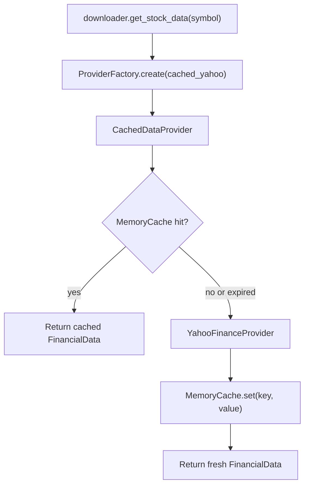
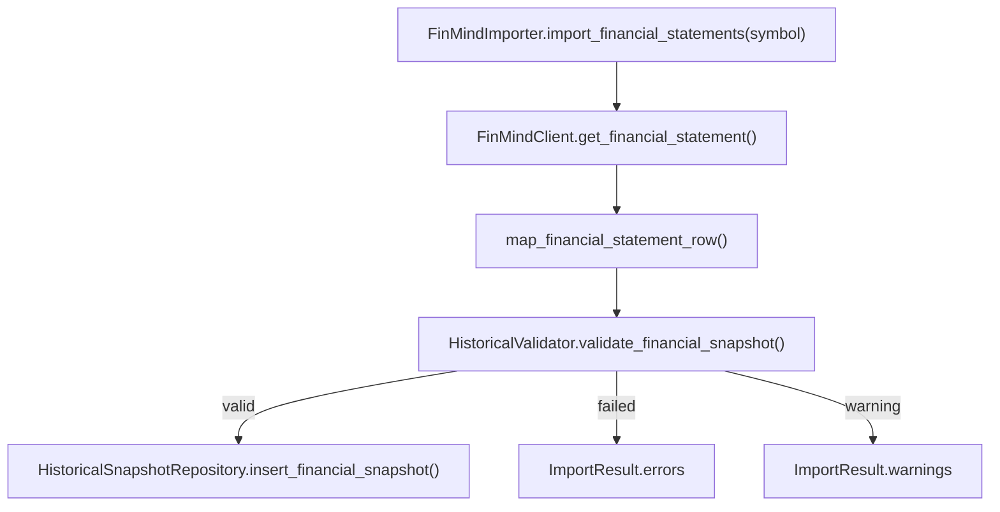
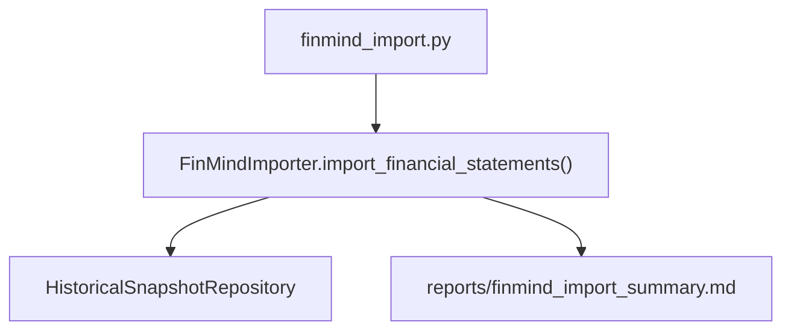

# StockAnalyzerPro

[](https://github.com/zx5875372-source/StockAnalyzerPro/actions/workflows/python-tests.yml)

## Project Status

See [PROJECT_STATUS.md](PROJECT_STATUS.md) for current version, phase, completed work, limitations, test status, and next milestone.

StockAnalyzerPro is a Python CLI stock analysis project for personal investment research. It focuses on producing a repeatable Markdown report from a fixed investment logic, rather than only fetching market data.

Current version: v2.25 Historical Pipeline Smoke Test

## Current Features

- Fetches stock and financial data with yfinance.
- Normalizes raw data into FinancialData and FinancialPeriod models.
- Generates a fixed-format Markdown stock analysis report.
- Calculates complete Piotroski F-Score 9 items.
- Calculates SAP Score with a 100-point weighted scoring engine.
- Includes profitability, financial health, cashflow, valuation, and growth analysis.
- Estimates simplified valuation, buy zones, and first target price.
- Shows diagnostics when required financial fields are missing.
- Provides a validation scan over a sample stock universe and exports CSV results.
- Provides an interactive v2.3 CLI console for stock analysis, historical data tools, research tools, and project status.
- Provides a Backtest Engine MVP for historical price validation of SAP Score selections.
- Provides an initial data provider framework for Yahoo Finance, CSV snapshots, and unit-test mocks.
- Provides a formal strategy framework with registry-based SAP Score strategy wiring.
- Provides multiple backtest strategies through `--strategy sap` and `--strategy piotroski`.
- Provides a strategy comparison report for SAP and Piotroski backtests.
- Provides a research report generated from strategy comparison results.
- Provides initial point-in-time historical snapshot dataclasses and SQLite schema definitions.
- Provides a repository layer for storing and querying historical snapshots in SQLite.
- Provides a Snapshot Generator MVP that writes current analyzer proxy SAP Score snapshots into the historical repository.
- Provides a Historical Import Framework for future CSV and external data imports.
- Provides a Historical Validation Framework for validating snapshot metadata, dates, scores, and duplicate keys.
- Provides a Historical Import CLI for validating CSV files and writing snapshots into the historical repository.
- Provides reusable historical import sample CSV fixtures and format documentation.
- Provides a Data Quality Profiling Framework for imports and historical repositories.
- Provides a FinMind importer framework with partial financial statement import integration.
- Provides a FinMind API Client with financial statement request methods, retry handling, and clear API exceptions.
- Provides a consolidated architecture overview and dependency rules for all frameworks.
- Provides FinMind API mapping helpers for converting raw rows into historical snapshot dataclasses.
- Provides FinMind financial statement import integration through mapper, validator, and historical repository writes.
- Provides a FinMind import CLI for writing financial statement snapshots into the historical repository.
- Provides a FinMind smoke test guide and helper script for safe real-API testing with a test database.
- Provides a Historical SAP Generator MVP for turning financial statement snapshots into repository SAP score snapshots.
- Provides a Historical SAP Generator CLI for filtered and incremental repository generation runs.
- Provides Historical Qualification reporting for separating point-in-time-safe snapshots from research-only fallback data.
- Provides a Backtest Qualification Gate for marking repository backtests as formal point-in-time or research-only.
- Provides an end-to-end historical pipeline smoke test from financial CSV import to SAP snapshot generation.

## Installation

Create and activate the Python virtual environment:

```powershell
python -m venv .venv
.venv\Scripts\Activate.ps1
```

Install dependencies:

```powershell
pip install -r requirements.txt
```

## Architecture Overview

The consolidated project architecture, dependency rules, framework responsibilities, and allowed import matrix are documented at:

```text
docs/ARCHITECTURE_OVERVIEW.md
```

Use this document as the review baseline before adding new data sources, importers, strategies, historical stores, or research reports.

## Run

Start the CLI:

```powershell
python app.py
```

Or run directly with the project virtual environment:

```powershell
.venv\Scripts\python.exe app.py
```

Main console:

```text
StockAnalyzerPro v2.3
Historical Pipeline MVP

【股票分析】
1. 分析單一股票
2. 掃描自選股 watchlist
3. 掃描 sample stocks

【歷史資料】
4. FinMind 匯入財報
5. Historical SAP Generator

【研究工具】
6. Backtest
7. Strategy Compare
8. Research Report

【系統】
9. Project Status
0. 離開
```

Options `1`, `2`, and `3` keep the existing single-stock analysis, watchlist scan, and sample scan flows.
Options `4` through `8` launch the existing CLI tools: `finmind_import.py`, `historical_generate_sap.py`, `backtest.py`, `strategy_compare.py`, and `research_report.py`.
Option `9` displays `PROJECT_STATUS.md`.

Reports are generated in the `reports/` folder.

## Batch Scan

You can run scans from the `app.py` menu, or run `scan.py` directly.

Run the default watchlist scan:

```powershell
.venv\Scripts\python.exe scan.py
```

Run the sample universe scan:

```powershell
.venv\Scripts\python.exe scan.py --sample
```

Run the watchlist scan explicitly:

```powershell
.venv\Scripts\python.exe scan.py --watchlist
```

The sample scan reads:

```text
tests/sample_data/sample_stocks.json
```

The watchlist scan reads:

```text
data/watchlist.json
```

The CSV output is written to:

```text
reports/scan_results.csv
```

The scan result includes SAP Score, Piotroski F-Score, fair price, first target price, diagnostics count, runtime, and per-symbol error messages when analysis fails.

v1.2 scan output also includes:

- `missing_count`: number of missing normalized financial fields.
- `missing_fields`: the missing field names.
- `data_quality_score`: `100 - missing_count * 5`, with a minimum of 0.
- `piotroski_available`: number of Piotroski items that can be calculated.
- `valuation_available`: number of valuation base prices available.
- `growth_available`: number of growth rates available.

The CSV is sorted by SAP Score from high to low, then data quality score from high to low.

The scan also writes a summary report:

```text
reports/scan_summary.md
```

Additional ranking reports:

```text
reports/top10.md
reports/watchlist_report.md
```

Use the summary to review total sample count, success rate, average SAP Score, average data quality score, the stocks with the most missing data, and the top 10 SAP Score stocks. Use the watchlist report to review SAP Score, grade, whether price is below the reasonable buy point, first target price, and data quality for your selected stocks.

## Data Layer

Milestone 3 Sprint 1 adds the initial Provider Framework under:

```text
data_provider/
```

The framework introduces:

- `IDataProvider`: stable provider contract for normalized financial data, price history, universes, and diagnostics.
- `YahooFinanceProvider`: yfinance adapter with access to `info`, `financials`, `balance_sheet`, `cashflow`, and `history`.
- `CSVProvider`: strict CSV reader for SAP Score snapshot CSV files.
- `MockProvider`: deterministic in-memory provider for unit tests.
- `ProviderFactory`: factory for `yahoo`, `yfinance`, `yahoo_finance`, `csv`, and `mock`.

Cache layer design and implementation status:

- `docs/CACHE_LAYER_ARCHITECTURE.md` defines the cache key, TTL, interface, SQLite schema, failure handling, and migration plan.
- `data_provider/cache/` contains the first cache implementation.
- `CacheKey`: canonical key using provider, symbol, data type, period, start date, and end date.
- `CacheEntry`: stores Python object payloads with fetched and expiration metadata.
- `ICache`: storage-agnostic cache contract for `get`, `set`, `exists`, `invalidate`, and `clear`.
- `MemoryCache`: in-memory cache with TTL expiration checks.
- `CachedDataProvider`: wraps any `IDataProvider`, checks cache first, calls the provider only on cache miss or expired cache, then writes successful provider results back to cache.
- `SQLiteCache`: durable cache MVP backed by `cache.db`, with automatic `cache_entries` schema creation, TTL checks, JSON payload storage, and payload hash validation.
- `SQLiteCache` currently supports `dict`, JSON-compatible values, `FinancialData`, and `PriceHistory`. Direct DataFrame payloads are intentionally not supported.
- `SQLiteCache` is implemented but is not connected to `CachedDataProvider` or `ProviderFactory` by default yet.

Cached provider flow:



Current Sprint boundary:

- `modules/downloader.py` now creates `cached_yahoo` through `ProviderFactory`.
- The public downloader API remains `get_stock_data(symbol)`.
- Analyzer is not changed and still receives `FinancialData`.
- App, scan, and analyzer flows continue to call the existing downloader API.
- `cached_yahoo` uses `MemoryCache`, `CachedDataProvider`, and `YahooFinanceProvider`.
- `SQLiteCache` remains available for tests and future integration, but runtime provider flow still uses `MemoryCache`.
- Provider Framework is covered by unit tests and is ready for later integration.

## Planned Data Sources

Current and planned data-source roles:

- Yahoo Finance: current runtime market and financial data source through `YahooFinanceProvider`.
- CSV: current historical snapshot import source through `CSVHistoricalImporter`.
- FinMind (Partial): historical Taiwan financial statement import source; `FinMindImporter` can import financial statement snapshots through mapper, validator, and repository writes. SAP score snapshot import is still planned.
- OpenBB (Planned): future multi-source research data option.
- Polygon (Planned): future market data option.

FinMind architecture documentation:

```text
docs/FINMIND_IMPORTER_ARCHITECTURE.md
```

## FinMind Client

Milestone 5.7 Sprint 4 adds request methods to the FinMind client package under:

```text
importers/finmind/
```

The package introduces:

- `FinMindConfig`: base URL, token, timeout, and max retry settings.
- `FinMindClient`: stores config, creates a session, manages optional token headers, and exposes financial statement request methods.
- `FinMindSession`: lightweight HTTP session wrapper used by the MVP client.
- `FinMindResponse`: normalized API response model with `status`, `message`, and `data`.
- `FinMindError`, `FinMindAPIError`, `FinMindRateLimitError`, and `FinMindAuthenticationError`.

Request methods:

- `get_financial_statement(stock_id, start_date=None, end_date=None)`
- `get_balance_sheet(stock_id, start_date=None, end_date=None)`
- `get_cash_flow(stock_id, start_date=None, end_date=None)`

Client behavior:

- Requests go through `_request(dataset, stock_id, start_date=None, end_date=None)`.
- Query params include `dataset`, `data_id`, optional date range, and optional token.
- Timeout and retry settings come from `FinMindConfig`.
- HTTP errors, rate limits, and authentication errors are normalized into FinMind exceptions.

Current boundary:

- Unit tests use mock sessions and do not call the real FinMind API.
- `FinMindImporter` uses `FinMindClient` for financial statement import, but unit tests use mock clients.
- Historical Repository, Analyzer, Provider, Strategy, Backtest, and SAP Score behavior are unchanged.

## FinMind Importer Integration

Milestone 5.7 Sprint 5 connects the FinMind financial statement import pipeline:



Supported behavior:

- FinMind financial statement rows are mapped into `FinancialStatementSnapshot`.
- Invalid rows are not written to the repository and are recorded in `ImportResult.errors`.
- Validation warnings are recorded in `ImportResult.warnings` while still allowing repository writes.
- FinMind API errors are converted into a failed `ImportResult`.

Current boundary:

- SAP score snapshot import from FinMind is not implemented yet.
- Unit tests use a mock `FinMindClient` and do not call the real FinMind API.
- Analyzer, Provider, Strategy, Backtest, and SAP Score behavior are unchanged.

## FinMind Import CLI

Milestone 5.7 Sprint 6 adds:

```text
finmind_import.py
```

Example:

```powershell
.venv\Scripts\python.exe finmind_import.py --symbol 2330 --start 2025-01-01 --end 2025-12-31 --db historical_snapshots_test.db
```

Token options:

- `--token <token>` has first priority.
- `FINMIND_TOKEN` is used when `--token` is not provided.
- Token may be empty, but FinMind anonymous access can be rate-limited or unavailable depending on the dataset and FinMind API policy.

CLI flow:



The summary report includes symbol, start date, end date, imported count, failed count, warning count, errors, warnings, and repository database path.

Current boundary:

- The CLI imports FinMind financial statement snapshots only.
- SAP score snapshot import from FinMind remains planned.
- Unit tests use mock importers and do not call the real FinMind API.
- Analyzer, Provider, Strategy, Backtest, SAP Score, and FinMindClient request logic are unchanged.

## FinMind Smoke Test

Milestone 5.7 Sprint 7 adds a real-API smoke test guide:

```text
docs/FINMIND_SMOKE_TEST.md
```

Recommended smoke test:

```powershell
.\scripts\finmind_smoke_test.ps1
```

The script runs:

```powershell
.venv\Scripts\python.exe finmind_import.py --symbol 2330 --start 2024-01-01 --end 2024-12-31 --db historical_snapshots_test.db
```

Safety notes:

- Set `FINMIND_TOKEN` before testing when available.
- Use `historical_snapshots_test.db` for smoke tests.
- Review `reports/finmind_import_summary.md` after each run.
- Do not run smoke tests against `historical_snapshots.db`.

## FinMind API Mapping

Milestone 5.7 Sprint 3 adds mapper helpers under:

```text
importers/finmind/mappers.py
```

The mapping layer introduces:

- `map_financial_statement_row(row)`: converts a FinMind-style dict into `FinancialStatementSnapshot`.
- `map_sap_snapshot_row(row)`: converts a FinMind-style dict into `SAPScoreSnapshot`.
- `FinMindMappingError`: clear errors for missing or invalid required fields.

Mapping behavior:

- Accepts common aliases such as `stock_id`/`symbol`, `date`/`statement_date`, and `release_date`/`published_date`.
- Converts Republic of China years to Gregorian years.
- Maps fiscal quarter from explicit `quarter` or from `statement_date`.
- Sets `source=finmind`, `source_version=v1`, and `is_point_in_time=true`.

Current boundary:

- Mapping does not call the FinMind API.
- Mapping itself does not write to `HistoricalSnapshotRepository`.
- `FinMindImporter` currently uses financial statement mapping only; SAP snapshot import remains planned.

## Strategy Framework

Milestone 4 Sprint 2 adds the formal strategy package under:

```text
strategy/
```

The framework introduces:

- `BaseStrategy`: shared contract for strategy evaluation, ranking, selection, and rebalance behavior.
- `StrategyResult`: normalized strategy output with score, rank, selected flag, reasons, warnings, and metrics.
- `StrategyRegistry`: registry for `register`, `unregister`, `get`, and `list`.
- `SAPScoreStrategy`: current SAP Score backtest selection logic moved into the formal strategy package without changing threshold behavior.
- `PiotroskiStrategy`: selects stocks with Piotroski score >= 7 and data quality score >= 80.

Backtest integration status:

- `BacktestEngine` now depends on `strategy.base_strategy.BaseStrategy`.
- `backtest/strategy.py` remains as a compatibility re-export for existing imports.
- `backtest.py --strategy` supports `sap` and `piotroski`.
- Current SAP Score algorithm and analyzer behavior are unchanged.

## Historical Snapshots

Milestone 5 Sprint 2 adds the initial point-in-time snapshot schema layer under:

```text
historical/
```

The historical layer introduces:

- `FinancialStatementSnapshot`: versioned statement snapshot metadata.
- `SAPScoreSnapshot`: historical SAP / Piotroski score snapshot metadata.
- `SnapshotMetadata`: generation and provenance metadata.
- `HISTORICAL_SNAPSHOT_SCHEMA`: SQLite schema string for `financial_statement_snapshots`, `sap_score_snapshots`, and `snapshot_metadata`.
- `HistoricalSnapshotRepository`: SQLite repository for initializing schema, inserting financial/SAP snapshots, querying snapshots, and listing snapshot dates or symbols.
- `SnapshotGenerator`: runs the current analyzer flow through `scan_stock()`, builds `SAPScoreSnapshot` rows, and writes them to `HistoricalSnapshotRepository`.

Build current-analysis proxy SAP Score snapshots into the repository:

```powershell
.venv\Scripts\python.exe snapshot_repository_builder.py
```

The repository builder reads:

```text
tests/sample_data/sample_stocks.json
```

It writes SAP Score snapshots to:

```text
historical_snapshots.db
```

It also writes a summary report to:

```text
reports/snapshot_repository_summary.md
```

Snapshot Generator MVP fields:

- `snapshot_date`: today's date unless `--snapshot-date` is provided.
- `source`: `current_analysis_proxy`.
- `source_version`: `v0`.
- `is_point_in_time`: `false`.
- `warning`: `not_point_in_time`.

Only `SAPScoreSnapshot` rows are written in this Sprint. `FinancialStatementSnapshot` generation is deferred.

Current boundary:

- No historical data fetching is implemented yet.
- Analyzer, provider, and backtest behavior are unchanged.
- Snapshot Generator MVP uses current analyzer output as a proxy and must not be treated as formal point-in-time data.

## Historical SAP Generator

Milestone 6 Sprint 2 adds:

```text
historical/sap_generator.py
```

The MVP generator introduces:

- `HistoricalSAPGenerator.generate_snapshot(financial_snapshot)`: converts one `FinancialStatementSnapshot` into one `SAPScoreSnapshot`.
- `HistoricalSAPGenerator.generate_all()`: reads all financial statement snapshots from `HistoricalSnapshotRepository` and writes generated SAP snapshots back into the repository.
- `HistoricalSAPGenerator.generate_incremental()`: rebuilds only affected periods when a SAP snapshot is missing, the generator version changed, or the publication timeline changed.
- `HistoricalSAPGenerationResult`: records generated, updated, skipped, failed, warnings, errors, affected periods, and generated snapshots.
- `reports/historical_generator_summary.md`: summary report for generator runs.
- `historical_generate_sap.py`: CLI for generating SAP snapshots from repository financial snapshots.

The generator reuses the existing analyzer/SAP scoring path and does not reimplement SAP Score logic.

Generate SAP snapshots for all financial snapshots:

```powershell
.venv\Scripts\python.exe historical_generate_sap.py --db historical_snapshots.db
```

Generate only one symbol:

```powershell
.venv\Scripts\python.exe historical_generate_sap.py --db historical_snapshots.db --symbol 2330
```

Generate only one fiscal period:

```powershell
.venv\Scripts\python.exe historical_generate_sap.py --db historical_snapshots.db --year 2025 --quarter 1
```

Run incremental generation:

```powershell
.venv\Scripts\python.exe historical_generate_sap.py --db historical_snapshots.db --incremental
```

The CLI writes:

```text
reports/historical_generator_summary.md
```

The summary includes database path, incremental mode, generated count, updated count, skipped count, failed count, warning count, affected periods, and filters used.

End-to-end historical pipeline smoke test:

```powershell
.\scripts\historical_pipeline_smoke_test.ps1
```

The smoke test runs:

```text
CSV financial snapshots
-> historical_import.py
-> HistoricalSnapshotRepository
-> historical_generate_sap.py
-> SAPScoreSnapshot rows
-> reports/historical_pipeline_smoke_test.md
```

It uses:

```text
historical_pipeline_test.db
```

The pipeline report includes imported financial snapshot count, generated SAP snapshot count, failed count, warnings, database path, and point-in-time status.

Current boundary:

- Backtest can read repository SAP snapshots through `--snapshot-source repository`, but full historical performance validation is still in progress.
- Strategy is not modified.
- Analyzer is not modified.
- Provider is not modified.
- SAP Score scoring logic is not modified.
- Generated snapshots remain research artifacts until point-in-time publication dates and historical price coverage are fully qualified.

## Historical Qualification

Historical qualification separates formal point-in-time snapshots from research-only fallback rows before using repository data for performance validation.

Run qualification:

```powershell
.venv\Scripts\python.exe historical_qualify.py --db historical_snapshots.db
```

Write to a custom report path:

```powershell
.venv\Scripts\python.exe historical_qualify.py --db historical_snapshots.db --output reports/historical_qualification_report.md
```

The report includes total snapshots, financial snapshot count, SAP snapshot count, point-in-time count, research-only count, missing published-date count, not-point-in-time count, qualified SAP snapshot count, and whether the repository can be used for formal backtest validation.

Rows with `missing_published_date` or `not_point_in_time` are classified as research-only.

## Historical Import Framework

Milestone 5.5 Sprint 1 adds the initial import framework under:

```text
importers/
```

The framework introduces:

- `BaseImporter`: shared importer contract with `supports()`, `import_snapshot()`, `import_financial_statements()`, `name`, and `version`.
- `ImportResult`: normalized import output with imported/skipped/failed counts, imported snapshot objects, and row-level errors.
- `ImporterRegistry`: registry for `register`, `unregister`, `get`, and `list`.
- `MockImporter`: deterministic importer for unit tests.
- `CSVHistoricalImporter`: CSV importer for `FinancialStatementSnapshot` and `SAPScoreSnapshot` rows.
- `historical_import.py`: CLI for importing validated historical CSV snapshots into `HistoricalSnapshotRepository`.

Import historical SAP Score snapshots:

```powershell
.venv\Scripts\python.exe historical_import.py --type sap --file path\to\sap_scores.csv --db historical_snapshots.db
.venv\Scripts\python.exe historical_import.py --type sap --file tests/sample_data/historical/sap_snapshots_valid.csv
```

Import historical financial statement snapshots:

```powershell
.venv\Scripts\python.exe historical_import.py --type financial --file path\to\financial.csv --db historical_snapshots.db
.venv\Scripts\python.exe historical_import.py --type financial --file tests/sample_data/historical/financial_snapshots_valid.csv
```

The CLI writes a summary report to:

```text
reports/historical_import_summary.md
```

The summary includes imported count, failed count, warning count, row-level errors, and row-level warnings.

Reusable sample CSV files:

```text
tests/sample_data/historical/sap_snapshots_valid.csv
tests/sample_data/historical/sap_snapshots_invalid.csv
tests/sample_data/historical/financial_snapshots_valid.csv
tests/sample_data/historical/financial_snapshots_invalid.csv
```

CSV format documentation:

```text
docs/HISTORICAL_IMPORT_FORMAT.md
```

Current import boundary:

- CSV import validates rows with `HistoricalValidator` before repository writes.
- Valid `SAPScoreSnapshot` and `FinancialStatementSnapshot` rows are written to `HistoricalSnapshotRepository`.
- Validation failures are not written and are reported in the summary.
- Validation warnings are reported but still allow repository writes.
- No real historical data provider is called.
- Analyzer, provider, backtest, strategy, SAP Score, and Snapshot Generator behavior are unchanged.

## Historical Validation Framework

Milestone 5.5 Sprint 2 adds the initial validation framework under:

```text
historical/validation/
```

The framework introduces:

- `HistoricalValidator`: validates `FinancialStatementSnapshot` and `SAPScoreSnapshot` dataclasses.
- `ValidationResult`: normalized validation output with `is_valid`, `errors`, `warnings`, `field_count`, and `missing_fields`.
- `rules.py`: shared validation rules for required fields, ISO dates, fiscal periods, score ranges, credibility grades, point-in-time flags, and duplicate snapshot warnings.

Validation rules currently cover:

- `symbol`
- `snapshot_date`
- `published_date`
- `fiscal_year`
- `fiscal_quarter`
- `sap_score`
- `piotroski_score`
- `data_quality_score`
- `credibility_grade`
- `is_point_in_time`

Current validation boundary:

- Validation runs on in-memory snapshot dataclasses only.
- `CSVHistoricalImporter` validates each CSV row before adding it to `ImportResult`.
- Validation failures are excluded from imported snapshots, increment `failed_count`, and record row-level errors.
- Validation warnings are recorded in `ImportResult.warnings`, but the snapshot is still imported.
- No API calls, repository writes, analyzer changes, SAP Score changes, or backtest behavior changes are included in this Sprint.

## Data Quality Profiling

Milestone 5.6 Sprint 1 adds the profiling framework under:

```text
historical/profiling/
```

The framework introduces:

- `HistoricalProfiler`: profiles import results and historical repositories.
- `ProfileResult`: normalized profile output with row counts, warning counts, duplicate counts, missing-field metrics, point-in-time metrics, and quality score.
- `metrics.py`: centralized calculations for percentages, duplicate/missing counts, and quality score.

Supported profiling entry points:

- `profile_import(import_result)`: profiles `ImportResult` from historical CSV import.
- `profile_repository(repository)`: profiles rows currently stored in `HistoricalSnapshotRepository`.

The initial quality score formula is:

```text
100 - failed_row_penalty - missing_field_penalty - duplicate_row_penalty
```

Current penalties:

- Failed row: `10` points per row.
- Missing field: `2` points per missing field.
- Duplicate row: `5` points per duplicate row.
- Minimum score: `0`.

The default data quality report is:

```text
reports/data_quality_report.md
```

The report includes Imported Rows, Failed Rows, Warnings, Duplicates, Missing %, Point-in-Time %, and Quality Score.

## Backtest MVP

Run the Sprint 3 Backtest Engine MVP:

```powershell
.venv\Scripts\python.exe backtest.py
.venv\Scripts\python.exe backtest.py --start 2024-01-01 --end 2025-12-31
.venv\Scripts\python.exe backtest.py --benchmark 006208.TW
.venv\Scripts\python.exe backtest.py --capital 500000
.venv\Scripts\python.exe backtest.py --strategy sap
.venv\Scripts\python.exe backtest.py --strategy piotroski
.venv\Scripts\python.exe backtest.py --snapshot-source repository --snapshot-db historical_snapshots.db
```

Compare strategies with the same backtest parameters:

```powershell
.venv\Scripts\python.exe strategy_compare.py
.venv\Scripts\python.exe strategy_compare.py --strategies sap piotroski
```

Generate the research report from strategy comparison output:

```powershell
.venv\Scripts\python.exe research_report.py
```

Build generated SAP Score snapshots:

```powershell
.venv\Scripts\python.exe snapshot_builder.py
```

The MVP uses:

- `tests/sample_data/sample_stocks.json` as the universe.
- Historical SAP Score snapshots from `data/snapshots/generated_sap_scores.csv` when available.
- Falls back to `data/snapshots/sample_sap_scores.csv` when generated snapshots do not exist.
- Can read generated SAP score snapshots directly from `historical_snapshots.db` with `--snapshot-source repository`.
- Default benchmark `0050.TW`.
- yfinance historical price data from `2023-01-01` to `2025-12-31`.
- Monthly rebalance.
- Equal-weight positions.
- Initial cash of `1000000`.

Outputs:

```text
reports/backtest_summary.md
reports/backtest_equity_curve.csv
reports/backtest_qualification.csv
reports/backtest_qualification.json
reports/strategy_comparison.md
reports/strategy_comparison.csv
reports/research_report.md
reports/snapshot_repository_summary.md
reports/historical_import_summary.md
```

Snapshot CSV columns:

```text
date,symbol,sap_score,piotroski_score,data_quality_score,source,warning
```

Important limitation: Sprint 3 used current SAP Score signals with historical prices, so its result should not be treated as formal backtest performance. Sprint 4 removes current-score fallback during backtest selection. Sprint 5 adds `generated_sap_scores.csv`, but it is still a proxy marked `source=current_analysis_proxy` and `warning=not_point_in_time`. Formal point-in-time snapshot generation is deferred until historical financial statements are available through FinMind, OpenBB, or another reliable provider.

Backtest credibility grades:

- `A`: look-ahead-safe and all snapshots have no warning.
- `B`: look-ahead-safe but some snapshots have warnings.
- `C`: not look-ahead-safe, or any snapshot has `not_point_in_time`.
- `D`: data is insufficient, or selected stock count is too low.

When the grade is `C` or `D`, the report states that the result is only for system testing and must not be used as investment strategy performance evidence.

Backtest qualification gate:

- Repository snapshot backtests include `qualification_grade`, `qualification_reason`, `research_only_count`, `point_in_time_count`, `missing_published_date_count`, and `not_point_in_time_count`.
- Repository snapshots with `missing_published_date` or `not_point_in_time` are marked research-only.
- When repository data is research-only, `reports/backtest_summary.md` states: `此回測僅供研究與系統驗證，不可視為正式 point-in-time 投資績效。`
- CSV snapshot backtests keep the existing credibility flow and show qualification as `N/A`.
- Backtest writes qualification exports to `reports/backtest_qualification.csv` and `reports/backtest_qualification.json`.

Backtest qualification export fields:

- `snapshot_source`
- `snapshot_db`
- `qualification_grade`
- `qualification_reason`
- `research_only_count`
- `point_in_time_count`
- `missing_published_date_count`
- `not_point_in_time_count`
- `is_formal_point_in_time`
- `generated_at`

Benchmark comparison:

- Backtest reports compare strategy return and CAGR against the benchmark.
- Default benchmark is `0050.TW`.
- If benchmark data is unavailable, the report shows `benchmark unavailable` and records diagnostics.
- Benchmark availability does not directly downgrade credibility.

Backtest CLI options:

- `--start`: start date, default `2023-01-01`.
- `--end`: end date, default `2025-12-31`.
- `--capital`: initial capital, default `1000000`.
- `--benchmark`: benchmark symbol, default `0050.TW`.
- `--snapshot`: snapshot CSV path, default `data/snapshots/generated_sap_scores.csv`.
- `--snapshot-source`: snapshot source, `csv` or `repository`, default `csv`.
- `--snapshot-db`: historical snapshot SQLite database path, default `historical_snapshots.db`.
- `--universe`: universe JSON path, default `tests/sample_data/sample_stocks.json`.
- `--strategy`: strategy name, `sap` or `piotroski`, default `sap`.

## Tests and CI

Run local checks:

```powershell
.venv\Scripts\python.exe -m py_compile app.py scan.py backtest.py snapshot_builder.py snapshot_repository_builder.py historical_import.py historical_generate_sap.py historical_qualify.py
.venv\Scripts\python.exe -m unittest discover -s tests/unit
```

GitHub Actions runs the same compile and unit test checks on push or pull request to `main` and `develop`.

`scan.py` is not executed in CI because it depends on yfinance network availability.

## Notes

- This project is for research and learning, not investment advice.
- Data quality depends on yfinance availability.
- Future versions may add additional data sources and backtesting workflows, but v1.4 keeps the ranking and watchlist workflow accessible from the CLI menu.
