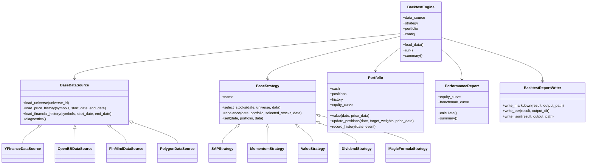

# Backtest Architecture

Research Platform Phase 1 focuses on historical validation of investment logic.
This backtest module is designed to verify whether SAP Score and future strategies
have predictive value over time.

This is not a trading simulator. The first goal is to answer:

- Did selected stocks outperform after selection?
- Was the signal stable across years and market regimes?
- Which data gaps or assumptions weaken the conclusion?
- Can the same engine validate SAP, momentum, value, dividend, and Magic Formula strategies?

## Design Scope

The first phase defined the architecture before implementation. Sprint 3 adds a
minimal implementation that follows this design without attempting a complete
historical financial statement backtest.

Planned folder structure:

```text
backtest/
  README.md
  data_sources/
    base.py
    yfinance_source.py
    openbb_source.py
    finmind_source.py
    polygon_source.py
  strategies/
    base.py
    sap_strategy.py
    momentum_strategy.py
    value_strategy.py
    dividend_strategy.py
    magic_formula_strategy.py
  engine.py
  portfolio.py
  performance.py
  reports.py
  outputs/
    markdown/
    csv/
    json/
```

## Sprint 3 MVP Design

Sprint 3 implements the smallest usable backtest engine following this architecture.

MVP scope:

- Universe: `tests/sample_data/sample_stocks.json`.
- Period: `2023-01-01` to `2025-12-31`.
- Initial cash: `1000000`.
- Rebalance frequency: monthly.
- Allocation: equal weight across selected stocks.
- Price data: yfinance historical adjusted close or close prices.
- Signal data: current SAP Score pipeline from the existing analyzer/scan flow.
- Output: `reports/backtest_summary.md` and `reports/backtest_equity_curve.csv`.

Important limitation:

This MVP uses the current SAP Score snapshot to filter stocks, then validates
historical price behavior for the selected set. It is useful for testing the
backtest plumbing, report output, and portfolio math, but it is not yet a
look-ahead-safe historical financial statement backtest. A future version must
calculate SAP Score from historical financial snapshots as of each rebalance date.

Sprint 3 performance must not be treated as formal backtest performance because
it combines today's SAP Score with past prices. That creates look-ahead bias risk.

MVP module responsibilities:

- `backtest/strategy.py`: selection rules and target weights only.
- `backtest/engine.py`: load universe, load price history, run monthly loop.
- `backtest/portfolio.py`: cash, positions, total value, and equity curve.
- `backtest/performance.py`: performance metrics from equity curve.
- `backtest/report.py`: Markdown and CSV output only.

## Sprint 4 Data Integrity Design

Sprint 4 replaces current-score fallback with historical SAP Score snapshots.

Snapshot source:

```text
data/snapshots/sample_sap_scores.csv
```

Required columns:

```text
date,symbol,sap_score,piotroski_score,data_quality_score
```

Rules:

- Strategy must use the latest snapshot with `snapshot.date <= rebalance_date`.
- Strategy must never use snapshots after the rebalance date.
- Strategy must never fallback to current analyzer or scan results.
- If a symbol has no valid snapshot as of the rebalance date, it is skipped.
- Skipped reasons must be shown in the backtest report.
- `look-ahead-safe` is true only when a snapshot source is loaded and no current
  score fallback is used.

MVP limitation after Sprint 4:

The sample snapshot file is still a simplified research fixture, not a complete
historical financial statement dataset. Sprint 4 improves data integrity by
removing current-score fallback, but formal production backtesting still requires
historical SAP Score generation from point-in-time financial statements.

## Sprint 5 Snapshot Builder Design

Sprint 5 adds a snapshot generation pipeline:

```text
snapshot_builder.py
  -> tests/sample_data/sample_stocks.json
  -> current analyzer / scan proxy
  -> data/snapshots/generated_sap_scores.csv
```

Generated snapshot columns:

```text
date,symbol,sap_score,piotroski_score,data_quality_score,source,warning
```

The builder currently creates quarterly rows for:

- 2023-03-31
- 2023-06-30
- 2023-09-30
- 2023-12-31
- 2024-03-31
- 2024-06-30
- 2024-09-30
- 2024-12-31
- 2025-03-31
- 2025-06-30
- 2025-09-30
- 2025-12-31

Current limitation:

`generated_sap_scores.csv` uses `source=current_analysis_proxy` and
`warning=not_point_in_time`. It repeats the current analysis result across
historical quarter dates because the analyzer cannot yet reconstruct historical
financial statements for each date.

Backtest snapshot priority:

1. `data/snapshots/generated_sap_scores.csv`
2. `data/snapshots/sample_sap_scores.csv`

Formal point-in-time snapshots are deferred until historical financial statement
data is available through FinMind, OpenBB, or another reliable provider.

## 1. Data Source

The backtest engine should not depend directly on yfinance. Each provider should
be hidden behind the same data source interface.

Current provider:

- yfinance

Future providers:

- OpenBB
- FinMind
- Polygon

Expected responsibilities:

- Load historical price data.
- Load historical financial statements.
- Load market metadata such as sector, industry, and exchange.
- Normalize source-specific fields into stable internal models.
- Report missing fields and data quality issues.

Proposed interface:

```python
class BaseDataSource:
    def load_universe(self, universe_id: str) -> list[str]:
        raise NotImplementedError

    def load_price_history(self, symbols: list[str], start_date: str, end_date: str):
        raise NotImplementedError

    def load_financial_history(self, symbols: list[str], start_date: str, end_date: str):
        raise NotImplementedError

    def diagnostics(self) -> list[str]:
        raise NotImplementedError
```

Design note:

The existing `FinancialData` and `FinancialPeriod` models should remain the
normalized financial layer for single-stock analysis. The backtest layer may
eventually need a `FinancialHistory` model that contains many annual or quarterly
periods per symbol.

## 2. Strategy Interface

Strategies should describe selection and portfolio rules. They should not fetch
raw data directly and should not write reports.

Core interface:

```python
class BaseStrategy:
    name: str

    def select_stocks(self, date, universe, data) -> list[str]:
        raise NotImplementedError

    def rebalance(self, date, portfolio, selected_stocks, data):
        raise NotImplementedError

    def sell(self, date, portfolio, data) -> list[str]:
        raise NotImplementedError
```

Responsibilities:

- `select_stocks()` ranks or filters the universe.
- `rebalance()` converts selected stocks into target weights.
- `sell()` defines exit rules.

Strategy examples:

- `SAPStrategy`: select stocks by SAP Score threshold or ranking.
- `MomentumStrategy`: select stocks with strong prior returns.
- `ValueStrategy`: select stocks by valuation ratios.
- `DividendStrategy`: select stocks by dividend yield and stability.
- `MagicFormulaStrategy`: select stocks by earnings yield and return on capital.

Design rule:

The strategy returns decisions. The engine executes the historical validation
workflow.

## 3. Backtest Engine

The engine coordinates data loading, scheduled evaluation, portfolio updates,
and final reporting.

Core interface:

```python
class BacktestEngine:
    def __init__(self, data_source, strategy, portfolio, config):
        self.data_source = data_source
        self.strategy = strategy
        self.portfolio = portfolio
        self.config = config

    def load_data(self):
        raise NotImplementedError

    def run(self):
        raise NotImplementedError

    def summary(self):
        raise NotImplementedError
```

Responsibilities:

- Load and validate historical data.
- Build the backtest calendar.
- Call strategy selection on each rebalance date.
- Update portfolio positions and equity curve.
- Store event history for auditability.
- Send results to the performance and report layers.

Important constraints:

- Avoid look-ahead bias by only using data available at the rebalance date.
- Keep execution assumptions explicit.
- Keep the engine independent from any single strategy.
- Keep the engine independent from any single data provider.

## 4. Portfolio

The portfolio records cash, positions, transaction history, and equity curve.

Core interface:

```python
class Portfolio:
    def __init__(self, initial_cash: float):
        self.cash = initial_cash
        self.positions = {}
        self.history = []
        self.equity_curve = []

    def value(self, date, price_data) -> float:
        raise NotImplementedError

    def update_positions(self, date, target_weights, price_data):
        raise NotImplementedError

    def record_history(self, date, event):
        raise NotImplementedError
```

Data fields:

- `cash`: uninvested capital.
- `positions`: symbol-level position records.
- `history`: rebalance, buy, sell, and diagnostic events.
- `equity_curve`: time series of portfolio value.

Design note:

Because this project is validating research signals rather than simulating live
orders, the first implementation can use simple assumptions such as close-price
execution and equal weight allocation.

## 5. Performance

The performance layer converts portfolio history into measurable results.

Core interface:

```python
class PerformanceReport:
    def __init__(self, equity_curve, benchmark_curve=None):
        self.equity_curve = equity_curve
        self.benchmark_curve = benchmark_curve

    def calculate(self) -> dict:
        raise NotImplementedError

    def summary(self) -> dict:
        raise NotImplementedError
```

Metrics:

- CAGR
- Sharpe
- Sortino
- Max Drawdown
- Win Rate
- Average Return
- Annual Return
- Monthly Return

Design note:

Performance should be calculated after the run. The strategy should not calculate
its own performance metrics.

## 6. Report

The report layer exports results without changing backtest logic.

Output formats:

- Markdown
- CSV
- JSON

Report responsibilities:

- Backtest configuration summary.
- Strategy parameters.
- Data source and data quality diagnostics.
- Portfolio equity curve.
- Annual and monthly returns.
- Performance metrics.
- Selected stocks on each rebalance date.

Proposed interface:

```python
class BacktestReportWriter:
    def write_markdown(self, result, output_path):
        raise NotImplementedError

    def write_csv(self, result, output_dir):
        raise NotImplementedError

    def write_json(self, result, output_path):
        raise NotImplementedError
```

## 7. Architecture

Backtest class diagram:



## Maintenance Review

Maintainability strengths:

- Data providers are replaceable through `BaseDataSource`.
- Strategies share one `BaseStrategy` interface.
- `BacktestEngine` coordinates the workflow but does not own strategy logic.
- `Portfolio` owns capital and position state.
- `PerformanceReport` owns metric calculations.
- `BacktestReportWriter` owns presentation and export.

Extensibility review:

- Momentum can be added as a strategy using price history only.
- Value can be added as a strategy using normalized financial history.
- Dividend can be added once dividend history is available from a data source.
- Magic Formula can be added with earnings yield and return on capital fields.
- SAP Strategy can reuse the existing scoring engine once historical financial
  snapshots are available.

Risks to resolve before implementation:

- Historical financial statement availability may vary by provider.
- Reporting dates must be handled carefully to avoid look-ahead bias.
- Taiwan stock symbols need stable exchange suffix handling.
- ETF backtests need separate handling because financial statement metrics may
  be unavailable.
- Benchmark selection should be explicit, such as 0050 or TAIEX.

Recommended implementation order:

1. Define minimal dataclasses for backtest config, price history, and result.
2. Implement `BaseDataSource` and a yfinance adapter.
3. Implement a simple equal-weight portfolio.
4. Implement `BacktestEngine` with one rebalance schedule.
5. Implement `SAPStrategy` after historical SAP Score data is reliable.
6. Add Markdown, CSV, and JSON exports.
