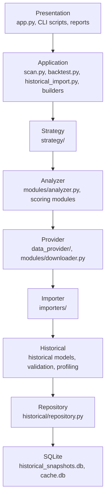

# Architecture Overview

This document consolidates the current StockAnalyzerPro frameworks and dependency rules.

The goal is to keep future FinMind, OpenBB, Polygon, and other data-source work from creating circular dependencies or mixing responsibilities across analyzer, provider, importer, backtest, and historical storage layers.

## Project Layer Diagram

The intended dependency direction is top-down. Lower layers must not import higher layers.



This diagram is a boundary map, not a statement that every layer must call the next layer in every runtime path. Existing legacy entry points may be narrower, but new code should respect this direction.

## Dependency Rules

### General Rules

- Dependencies flow from presentation toward storage.
- Lower-level modules must not import higher-level orchestration modules.
- Domain dataclasses may be shared downward or sideways only when they are stable contracts.
- Reports are presentation output only and must not contain business logic.
- CLI scripts orchestrate modules but should not own strategy, scoring, validation, import, or persistence rules.
- Frameworks should depend on interfaces or dataclasses instead of concrete application scripts.

### Analyzer Rules

Analyzer must remain focused on scoring and business analysis.

Analyzer may depend on:

- `models.financial_data.FinancialData`
- analyzer/scoring helpers under `modules/`
- standard-library utilities

Analyzer must not depend on:

- Historical Repository
- Importer Framework
- Backtest Engine
- Strategy Framework
- Historical snapshot storage
- CLI scripts
- Report writers

Analyzer should not directly fetch data. Data should be supplied as `FinancialData`.

### Provider Rules

Provider is responsible for retrieving and normalizing current or market data.

Provider may depend on:

- provider interfaces and cache abstractions
- source adapters such as Yahoo Finance
- domain models needed to return `FinancialData` or `PriceHistory`

Provider must not depend on:

- Historical Repository
- Importer Framework
- Analyzer
- Strategy Framework
- Backtest Engine
- Presentation/report output

### Importer Rules

Importer is responsible for converting external or file-based historical data into snapshot dataclasses.

Importer may depend on:

- `BaseImporter`
- `ImportResult`
- historical snapshot dataclasses
- Historical Validator
- source-specific clients such as `FinMindClient`

Importer must not depend on:

- Analyzer
- SAP Score
- Backtest Engine
- Strategy Framework
- Provider Framework
- Repository writes, except through explicit CLI/application orchestration

### Historical Rules

Historical modules define durable data structures and validation/profiling behavior.

Historical may depend on:

- historical dataclasses
- validation rules
- profiling metrics
- repository persistence where the module is explicitly repository-facing

Historical must not depend on:

- Analyzer
- Strategy Framework
- Backtest Engine
- Provider Framework
- Importer concrete implementations
- Presentation/report scripts

### Repository Rules

Repository owns persistence for historical snapshots.

Repository may depend on:

- historical models
- SQLite
- schema strings

Repository must not depend on:

- Analyzer
- Provider
- Importer
- Strategy
- Backtest
- CLI scripts
- Validation/profiling orchestration

### Strategy and Backtest Rules

Strategy owns stock-selection logic. Backtest owns simulation orchestration.

Strategy may depend on:

- strategy base classes and result models
- historical snapshot read models exposed by backtest/historical adapters
- analyzer outputs only when passed in by application orchestration

Strategy must not depend on:

- Repository writes
- Importers
- Providers
- CLI scripts

Backtest may depend on:

- Strategy interfaces
- portfolio/performance/report components
- snapshot read stores

Backtest must not depend on:

- Analyzer internals
- Importer implementation
- Provider implementation details beyond explicit price provider adapters

## Module Responsibilities

| Layer | Directories / Files | Responsibility | Must Avoid |
| --- | --- | --- | --- |
| Presentation | `app.py`, generated `reports/` | User interaction and rendered output | Scoring, importing, repository rules |
| Application | `scan.py`, `backtest.py`, `historical_import.py`, `snapshot_repository_builder.py`, `strategy_compare.py`, `research_report.py` | Orchestrate workflows | Owning domain rules |
| Strategy | `strategy/` | Selection logic and strategy registry | Data fetching and persistence |
| Analyzer | `modules/analyzer.py`, scoring modules | Convert `FinancialData` into SAP/Piotroski/valuation outputs | Fetching, importing, repository access |
| Provider | `data_provider/`, `modules/downloader.py` | Current data access and normalization | Historical persistence and analyzer logic |
| Importer | `importers/` | Historical external/file data conversion into snapshots | Analyzer, SAP Score, repository writes |
| Historical | `historical/` | Snapshot models, schema, validation, profiling | Data-source clients and strategies |
| Repository | `historical/repository.py`, `historical/schema.py` | SQLite persistence | Business logic and orchestration |
| Cache | `data_provider/cache/` | Provider data caching | Historical import/repository behavior |
| Research | `strategy_compare.py`, `research_report.py`, `reports/` | Compare strategy outputs and summarize research | Recomputing stock analysis or changing strategies |

## Directory Structure

```text
StockAnalyzerPro/
  app.py                         # interactive CLI presentation
  scan.py                        # batch scan application workflow
  backtest.py                    # backtest CLI
  historical_import.py           # historical CSV import CLI
  snapshot_builder.py            # proxy CSV snapshot builder
  snapshot_repository_builder.py # proxy repository snapshot builder
  research_report.py             # research report generation
  strategy_compare.py            # strategy comparison workflow
  modules/                       # analyzer, scoring, downloader compatibility API
  models/                        # core financial domain data models
  data_provider/                 # Provider Framework and Cache Framework
  strategy/                      # Strategy Framework
  backtest/                      # Backtest Engine
  historical/                    # historical models, schema, repository, validation, profiling
  importers/                     # Import Framework and source-specific importers
  docs/                          # architecture and format documentation
  tests/                         # unit and fixture tests
  reports/                       # generated reports and committed sample reports
```

## Framework Summary

### Provider Framework

Purpose:

- Retrieve current financial data, price history, universes, and diagnostics.
- Keep analyzer decoupled from concrete data sources.

Primary modules:

- `data_provider/interfaces.py`
- `data_provider/provider_factory.py`
- `data_provider/providers/`
- `modules/downloader.py`

Extension points:

- Add providers through `IDataProvider`.
- Register providers in `ProviderFactory`.
- Keep public downloader APIs stable when integrating new providers.

### Cache Framework

Purpose:

- Reduce repeated provider calls.
- Support TTL-based memory caching and future durable cache options.

Primary modules:

- `data_provider/cache/interfaces.py`
- `data_provider/cache/memory_cache.py`
- `data_provider/cache/sqlite_cache.py`
- `data_provider/cached_provider.py`

Extension points:

- Add new `ICache` implementations.
- Wrap providers with `CachedDataProvider`.
- Keep cache payload serialization isolated from analyzer and strategy layers.

### Strategy Framework

Purpose:

- Provide a common strategy interface and registry.
- Support SAP and Piotroski strategies without hard-coding backtest selection logic.

Primary modules:

- `strategy/base_strategy.py`
- `strategy/registry.py`
- `strategy/strategy_result.py`
- `strategy/sap_strategy.py`
- `strategy/piotroski_strategy.py`

Extension points:

- Add strategy classes implementing `BaseStrategy`.
- Register strategies in `StrategyRegistry`.
- Keep strategy scoring independent from data fetching and persistence.

### Historical Framework

Purpose:

- Define point-in-time snapshot dataclasses, schemas, and repository access.
- Store and query historical financial and SAP score snapshots.

Primary modules:

- `historical/models.py`
- `historical/schema.py`
- `historical/repository.py`
- `historical/generator.py`

Extension points:

- Add new snapshot dataclasses only when persistence requirements are clear.
- Keep repository methods persistence-focused.
- Keep point-in-time assumptions explicit in snapshot metadata.

### Import Framework

Purpose:

- Convert CSV or future external-source data into historical snapshot dataclasses.
- Keep historical data acquisition separate from analyzer and provider frameworks.

Primary modules:

- `importers/base_importer.py`
- `importers/registry.py`
- `importers/import_result.py`
- `importers/csv_historical_importer.py`
- `importers/finmind_importer.py`
- `importers/finmind/`

Extension points:

- Add source-specific importers implementing `BaseImporter`.
- Register importers in `ImporterRegistry`.
- Use application scripts such as `historical_import.py` for repository writes.

### Validation Framework

Purpose:

- Validate snapshot dataclasses before they are imported or persisted.
- Distinguish validation failures from warnings.

Primary modules:

- `historical/validation/validator.py`
- `historical/validation/rules.py`
- `historical/validation/validation_result.py`

Extension points:

- Add validation rules in `rules.py`.
- Keep validation results structured and row-level.
- Do not embed source-specific API logic in validation.

### Research Framework

Purpose:

- Compare strategies and generate research summaries.
- Report backtest outcomes without changing strategy behavior.

Primary modules:

- `strategy_compare.py`
- `research_report.py`
- `reports/strategy_comparison.md`
- `reports/research_report.md`

Extension points:

- Add report sections based on comparison output.
- Keep reports derived from existing result CSV/Markdown data.
- Do not call analyzer or mutate strategies from report generation.

## Allowed Import Matrix

Legend:

- `Y`: allowed
- `N`: not allowed
- `Adapter`: allowed only through a narrow adapter or application orchestration

| From / To | Presentation | Application | Strategy | Analyzer | Provider | Importer | Historical | Repository | Cache | Research |
| --- | --- | --- | --- | --- | --- | --- | --- | --- | --- | --- |
| Presentation | N | Y | Adapter | Adapter | N | Adapter | N | N | N | Adapter |
| Application | N | N | Y | Y | Y | Y | Y | Y | N | Y |
| Strategy | N | N | N | Adapter | N | N | Adapter | N | N | N |
| Analyzer | N | N | N | Y | N | N | N | N | N | N |
| Provider | N | N | N | N | Y | N | N | N | Adapter | N |
| Importer | N | N | N | N | N | Y | Y | N | N | N |
| Historical | N | N | N | N | N | N | Y | Adapter | N | N |
| Repository | N | N | N | N | N | N | Y | Y | N | N |
| Cache | N | N | N | N | Adapter | N | N | N | Y | N |
| Research | N | N | N | N | N | N | N | N | N | Y |

Concrete examples:

- Strategy can consume analyzer-like candidate outputs, but should not import analyzer internals directly unless mediated by application orchestration.
- Analyzer must not import Strategy.
- Importer must not import Analyzer.
- Provider must not import Repository.
- Repository must not import Importer.
- Historical validation can validate importer-created snapshots, but validation must not know about source-specific clients.
- `historical_import.py` is allowed to orchestrate Importer -> Validation -> Repository because it is an application boundary script.

## Extension Points

### Adding a New Data Provider

1. Implement `IDataProvider`.
2. Register it in `ProviderFactory`.
3. Keep analyzer calls through the existing downloader/API boundary.
4. Add focused unit tests with mock data.

### Adding a New Importer

1. Implement `BaseImporter`.
2. Return `ImportResult`.
3. Build historical snapshot dataclasses.
4. Validate snapshots with `HistoricalValidator`.
5. Register the importer in `ImporterRegistry`.
6. Write to repository only from an application script.

### Adding a New Historical Store

1. Keep repository interface persistence-focused.
2. Do not expose SQLite details to analyzer, strategy, importer, or provider layers.
3. Add migration docs before runtime integration.

### Adding a New Strategy

1. Implement `BaseStrategy`.
2. Register it in `StrategyRegistry`.
3. Keep data loading and repository access outside the strategy.
4. Add backtest and registry tests.

### Adding New Research Reports

1. Consume existing comparison or backtest outputs.
2. Do not recompute SAP Score.
3. Do not call provider or importer layers.
4. Keep report logic presentation-focused.

## Code Review Checklist

- Does the new module import only lower or same-layer contracts?
- Does the analyzer remain free from provider, importer, strategy, backtest, and repository imports?
- Does the importer avoid analyzer and repository writes?
- Does provider code avoid repository and importer imports?
- Are point-in-time assumptions explicit?
- Are warnings and failures represented structurally?
- Are future API clients opt-in and isolated?
- Are unit tests using fixtures or mocks instead of network calls?
