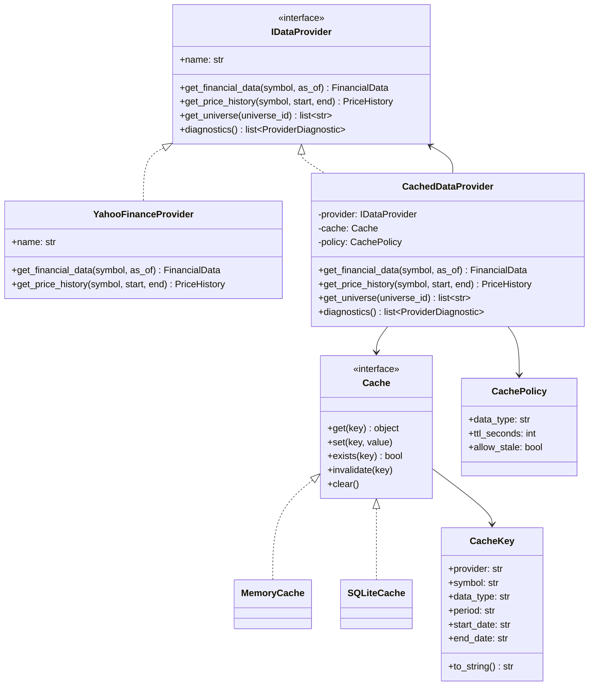
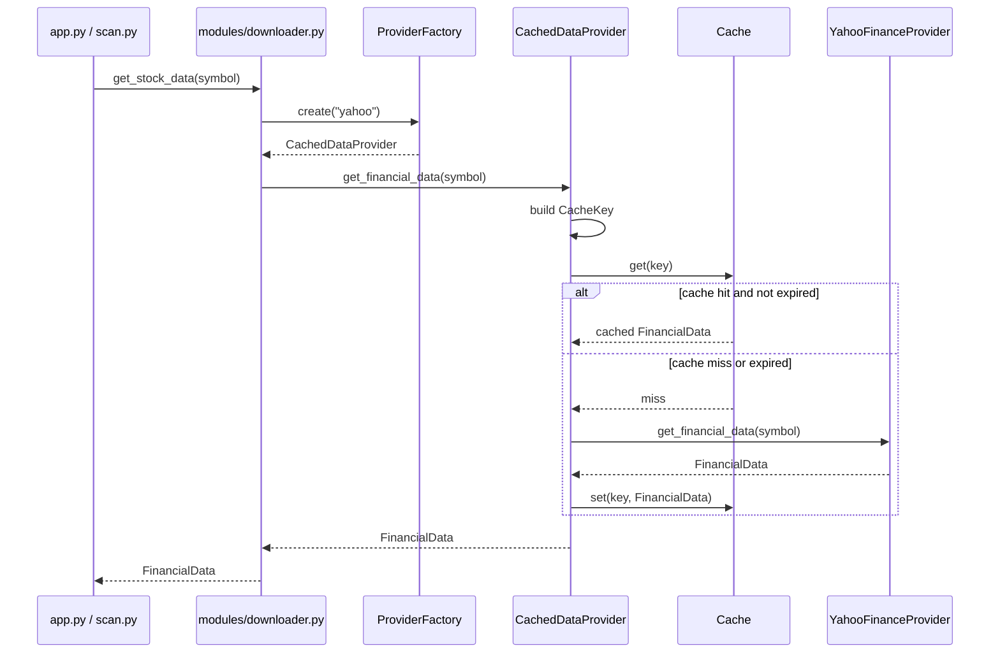
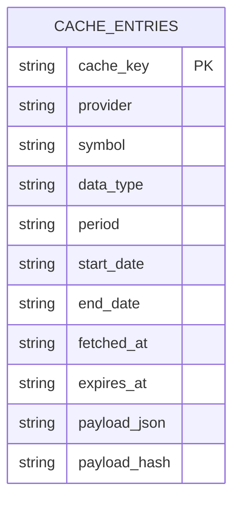

# Cache Layer Architecture

Milestone 3 Sprint 3 defines the cache layer architecture for
StockAnalyzerPro.

This document is design only. It does not change `modules/downloader.py`,
`modules/analyzer.py`, provider implementations, SAP Score, backtest strategy,
or runtime behavior.

## 1. Cache Goals

The cache layer should reduce repeated external data calls while preserving
enough metadata for research traceability.

Primary goals:

- Reduce duplicate yfinance downloads for repeated single-stock analysis,
  watchlist scans, sample scans, and future backtest data preparation.
- Speed up `scan.py --watchlist` and larger scan runs by reusing recently
  fetched data.
- Preserve provider source, symbol, data type, fetch time, and expiration time.
- Support future durable storage through SQLite first, and DuckDB later if the
  project needs analytical queries over larger historical datasets.
- Keep cache behavior behind provider interfaces so analyzer, scoring, reports,
  and strategy code do not read cache directly.

Non-goals for this sprint:

- Do not implement `MemoryCache`.
- Do not implement `SQLiteCache`.
- Do not change provider behavior.
- Do not add cache invalidation commands to CLI yet.
- Do not introduce OpenBB, FinMind, DuckDB, or any new dependency.

## 2. Cache Key Design

Cache keys must be deterministic and must uniquely describe the provider request.

Required key fields:

- `provider`: provider name, for example `yahoo`.
- `symbol`: normalized stock symbol, for example `2330.TW`.
- `data_type`: logical payload type, for example `info`, `financials`,
  `balance_sheet`, `cashflow`, `price_history`, or `snapshot`.
- `period`: statement period or data frequency when applicable, for example
  `annual`, `quarterly`, `daily`, or `none`.
- `start_date`: requested start date for ranged data, or empty for non-ranged
  data.
- `end_date`: requested end date for ranged data, or empty for non-ranged data.

Canonical string format:

```text
provider:symbol:data_type:period:start_date:end_date
```

Examples:

```text
yahoo:2330.TW:info:none::
yahoo:2330.TW:financials:annual::
yahoo:2330.TW:price_history:daily:2025-01-01:2025-12-31
csv:2330.TW:snapshot:none::
```

Normalization rules:

- Provider names are lowercase.
- Symbols use the existing normalized form, including `.TW` or `.TWO` where
  applicable.
- Empty date fields are represented as empty strings in the canonical key.
- `period` uses `none` when the data type does not have a period.
- Future key versions should be added as a new field only when existing cached
  payloads become incompatible.

## 3. Cache TTL Design

TTL should reflect how often each data type changes and how risky stale data is.

| Data Type | TTL | Expiration Rule |
|---|---:|---|
| `info` | 24 hours | Company metadata and market fields may change daily. |
| `financials` | 7 days | Annual and quarterly statements change less often, but yfinance can restate fields. |
| `balance_sheet` | 7 days | Same policy as financial statements. |
| `cashflow` | 7 days | Same policy as financial statements. |
| `price_history` | 1 day | Refresh daily price data after market data updates. |
| `snapshot` | Permanent or manual refresh | Snapshots must remain reproducible and should not expire automatically. |

TTL policy notes:

- Expired cache entries are not valid cache hits by default.
- Snapshot data should use `expires_at = NULL`.
- Stale fallback may be allowed only when explicitly requested by a future
  policy object.
- Provider diagnostics should record when stale fallback is used.

## 4. Cache Interface

The cache interface should stay small and storage-agnostic.

```python
class Cache:
    def get(self, key: CacheKey):
        raise NotImplementedError

    def set(self, key: CacheKey, value):
        raise NotImplementedError

    def exists(self, key: CacheKey) -> bool:
        raise NotImplementedError

    def invalidate(self, key: CacheKey) -> None:
        raise NotImplementedError

    def clear(self) -> None:
        raise NotImplementedError
```

Expected behavior:

- `get(key)` returns the cached payload when present and not expired.
- `get(key)` returns `None` or a cache miss result when missing or expired.
- `set(key, value)` writes payload plus metadata, including fetch time,
  expiration time, and payload hash.
- `exists(key)` returns true only for a present, non-expired entry unless a
  future `include_expired` option is added.
- `invalidate(key)` removes one cache entry or marks it invalid.
- `clear()` removes all cache entries for that cache instance.

Future implementation detail:

- `MemoryCache` can store Python objects directly for runtime speed.
- `SQLiteCache` should store JSON payloads for durability and auditability.
- Both implementations should share the same `CacheKey` and TTL policy.

## 5. SQLite Schema Design

SQLite is the first durable cache store. The schema should support auditing,
expiration, payload integrity checks, and later migration to DuckDB if needed.

Proposed table:

```sql
CREATE TABLE cache_entries (
    cache_key TEXT PRIMARY KEY,
    provider TEXT NOT NULL,
    symbol TEXT,
    data_type TEXT NOT NULL,
    period TEXT,
    start_date TEXT,
    end_date TEXT,
    fetched_at TEXT NOT NULL,
    expires_at TEXT,
    payload_json TEXT NOT NULL,
    payload_hash TEXT NOT NULL
);

CREATE INDEX idx_cache_entries_lookup
ON cache_entries (provider, symbol, data_type, period, start_date, end_date);

CREATE INDEX idx_cache_entries_expires_at
ON cache_entries (expires_at);
```

Required columns from this sprint:

- `provider`
- `symbol`
- `data_type`
- `fetched_at`
- `expires_at`
- `payload_json`
- `payload_hash`

Additional columns included for key traceability:

- `cache_key`
- `period`
- `start_date`
- `end_date`

Payload hash design:

- Hash should be computed from canonical JSON.
- The first implementation can use SHA-256 from Python standard library.
- Hash mismatch means the cache entry is corrupted and must not be trusted.

## 6. CacheProvider / CachedDataProvider Design

`CachedDataProvider` should wrap any `IDataProvider` implementation and preserve
the same public provider contract.

Responsibilities:

- Accept an inner provider, for example `YahooFinanceProvider`.
- Accept a cache implementation, for example `MemoryCache` or `SQLiteCache`.
- Build a cache key for each provider request.
- Check cache before calling the inner provider.
- Return cached normalized data on cache hit.
- On cache miss, call the inner provider.
- After a successful provider call, write the normalized result to cache.
- Preserve provider diagnostics and add cache diagnostics when needed.

Example shape:

```python
class CachedDataProvider(IDataProvider):
    def __init__(self, provider: IDataProvider, cache: Cache, policy: CachePolicy):
        self.provider = provider
        self.cache = cache
        self.policy = policy

    def get_financial_data(self, symbol: str, as_of: str | None = None) -> FinancialData:
        key = CacheKey(
            provider=self.provider.name,
            symbol=symbol,
            data_type="financials",
            period="annual",
            start_date=None,
            end_date=None,
        )

        cached = self.cache.get(key)
        if cached is not None:
            return cached

        value = self.provider.get_financial_data(symbol, as_of=as_of)
        self.cache.set(key, value)
        return value
```

Design rules:

- Analyzer should not know whether data came from cache.
- ProviderFactory can later decide whether to return a raw provider or a cached
  provider wrapper.
- Cache misses should not change provider results.
- Cache writes should happen only after provider calls succeed.
- Failed provider calls should not overwrite good cache entries.

## 7. Mermaid Architecture Diagrams

### Class Diagram



### Sequence Diagram



### SQLite ER Diagram



## 8. Failure Handling

Cache corruption:

- Detect by invalid JSON, failed deserialization, or payload hash mismatch.
- Treat corrupted entries as cache misses.
- Record a provider/cache diagnostic.
- Do not return corrupted payloads to analyzer or backtest.
- Optionally invalidate the corrupted entry after detection.

Expired cache:

- Expired entries are cache misses by default.
- Do not delete expired entries immediately unless cleanup is explicitly run.
- A future policy may allow stale fallback if provider calls fail.

Provider failed:

- If cache miss and provider fails, surface the provider error.
- Do not write failed responses into cache.
- If an unexpired cache entry exists, provider should not be called.
- If only expired cache exists, stale fallback is allowed only when
  `allow_stale=True`.

Stale fallback:

- Default policy: not allowed.
- Allowed only for read-only research flows when explicitly configured.
- Must add diagnostics such as `stale cache fallback used`.
- Must never be used for formal point-in-time snapshot generation unless the
  snapshot records the stale source and warning.

## 9. Testing Plan

Unit tests should use `MockProvider` and deterministic payloads. Network calls
must not be required.

Required test cases:

- Cache hit:
  - Preload cache with valid non-expired payload.
  - Call `CachedDataProvider`.
  - Assert inner provider is not called.
  - Assert cached payload is returned.
- Cache miss:
  - Start with empty cache.
  - Call `CachedDataProvider`.
  - Assert inner provider is called once.
  - Assert payload is written to cache.
- Expired:
  - Preload expired payload.
  - Call `CachedDataProvider`.
  - Assert expired entry is not returned by default.
  - Assert provider result replaces or supersedes expired payload.
- Invalidate:
  - Preload cache.
  - Call `invalidate(key)`.
  - Assert `exists(key)` is false.
  - Assert the next provider call becomes a cache miss.
- Provider error:
  - Configure inner provider to fail.
  - On cache miss, assert error is surfaced.
  - Assert cache is not overwritten.
  - With future stale fallback enabled, assert stale payload is returned and
    diagnostics include a stale warning.

SQLite-specific tests for Sprint 5:

- Payload is persisted and can be read by a new cache instance.
- `payload_hash` mismatch invalidates the entry.
- `expires_at = NULL` snapshot payloads do not expire automatically.

## 10. Migration Plan

Sprint 4: Implement `MemoryCache`

- Add `CacheKey`, `CachePolicy`, and `MemoryCache`.
- Add unit tests for hit, miss, expired, invalidate, and clear.
- Do not integrate with downloader yet unless explicitly scoped.

Sprint 5: Implement `SQLiteCache`

- Add SQLite schema and store implementation.
- Serialize normalized provider payloads to JSON.
- Add payload hash validation.
- Add persistence tests with temporary SQLite files.
- Do not introduce DuckDB yet.

Sprint 6: Integrate `CachedDataProvider`

- Add `CachedDataProvider` wrapper.
- Update `ProviderFactory` to optionally wrap providers with cache.
- Keep `modules/downloader.py` public API unchanged.
- Add tests proving repeated calls avoid repeated provider fetches.
- Add diagnostics for cache hit, miss, expired, corrupted, and stale fallback.
