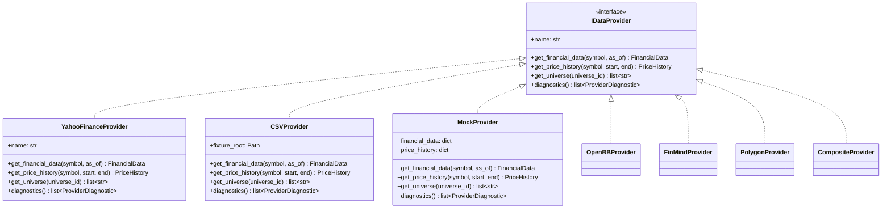
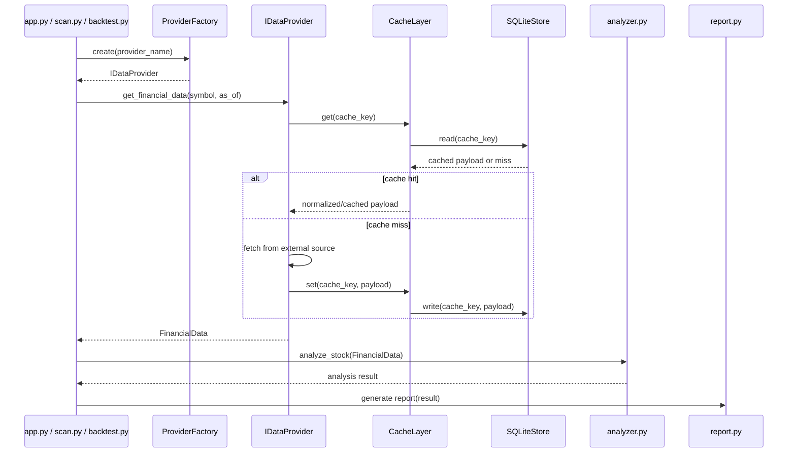
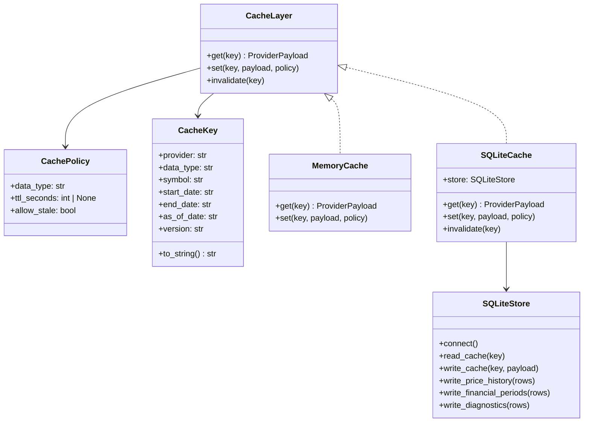
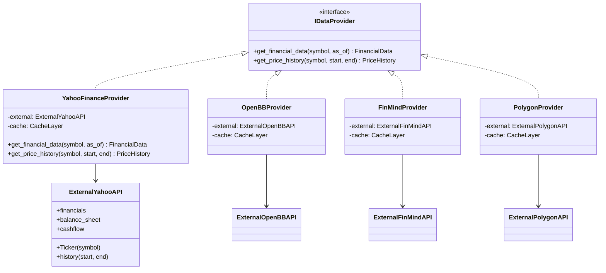
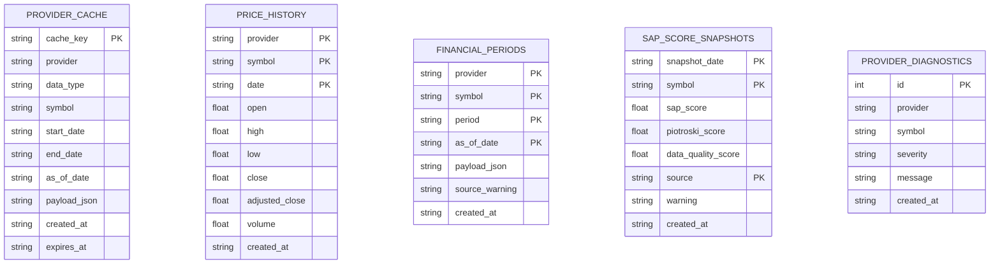

# Data Layer Architecture

Milestone 2 defines the formal data provider architecture for StockAnalyzerPro.

This document is architecture design only. It does not change the current
analyzer, downloader, backtest, report, SAP Score, or strategy implementation.

## Goals

- Keep analyzer independent from raw data sources.
- Normalize every provider into the same internal data models.
- Make yfinance replaceable without rewriting analyzer logic.
- Support CSV fixtures and mock data for unit tests.
- Add a cache layer before introducing heavier data sources.
- Prepare for SQLite-backed historical data and point-in-time snapshots.
- Leave clear extension points for OpenBB, FinMind, and Polygon.

## Non-Goals

- Do not change `modules/analyzer.py`.
- Do not replace `modules/downloader.py` in this milestone.
- Do not change SAP Score weights.
- Do not change backtest strategy logic.
- Do not add new external dependencies yet.

## Proposed Folder Structure

```text
data_layer/
  __init__.py
  interfaces.py
  provider_factory.py
  providers/
    yahoo_finance_provider.py
    csv_provider.py
    mock_provider.py
    openbb_provider.py
    finmind_provider.py
    polygon_provider.py
  cache/
    cache_policy.py
    cache_key.py
    memory_cache.py
    sqlite_cache.py
  storage/
    sqlite_store.py
    schema.sql
  diagnostics.py
```

The folder structure is a design target. It should be created only when
implementation begins.

## 1. IDataProvider Interface

`IDataProvider` is the stable contract between data sources and the rest of the
system.

Responsibilities:

- Return normalized financial data.
- Return historical price data.
- Return provider diagnostics.
- Hide provider-specific field names and API quirks.
- Never expose raw yfinance/OpenBB/FinMind/Polygon objects to analyzer.

Proposed interface:

```python
class IDataProvider:
    name: str

    def get_financial_data(self, symbol: str, as_of: str | None = None) -> FinancialData:
        raise NotImplementedError

    def get_price_history(self, symbol: str, start: str, end: str) -> PriceHistory:
        raise NotImplementedError

    def get_universe(self, universe_id: str) -> list[str]:
        raise NotImplementedError

    def diagnostics(self) -> list[ProviderDiagnostic]:
        raise NotImplementedError
```

Design notes:

- `as_of` is required for future point-in-time backtests.
- `FinancialData` remains the normalized model consumed by analyzer.
- `PriceHistory` can be a small wrapper around normalized OHLCV rows.
- Provider implementations may use cache internally, but consumers should not
  need to know whether data came from cache or network.

## 2. YahooFinanceProvider Adapter

`YahooFinanceProvider` adapts yfinance output into normalized internal models.

Responsibilities:

- Use current yfinance logic as the first provider implementation.
- Reuse existing field alias mapping where possible.
- Normalize `.TW` and `.TWO` suffix behavior.
- Convert yfinance statements into `FinancialData` and future
  `FinancialHistory`.
- Record missing fields and provider warnings.

Important rule:

The provider may know yfinance. Analyzer must not.

## 3. CSVProvider Adapter

`CSVProvider` reads local CSV files and returns the same models as live providers.

Use cases:

- Repeatable unit tests.
- Offline development.
- Regression fixtures for known stocks.
- Snapshot builder input/output validation.

Suggested CSV files:

```text
data/fixtures/
  financial_data.csv
  price_history.csv
  universes.csv
  provider_diagnostics.csv
```

CSVProvider should be strict:

- Missing required columns should raise a clear provider error.
- Invalid rows should be recorded as diagnostics.
- Data should be normalized before leaving the provider.

## 4. MockProvider

`MockProvider` is for unit tests only.

Responsibilities:

- Return deterministic financial and price data from in-memory objects.
- Simulate missing data and provider failures.
- Avoid network calls.
- Avoid file I/O unless a test explicitly injects fixture paths.

MockProvider makes unit tests possible for:

- Analyzer behavior.
- Backtest engine behavior.
- Snapshot builder behavior.
- Cache fallback behavior.

## 5. Cache Layer Design

The cache layer prevents repeated network calls and creates an audit trail for
data retrieval.

Cache responsibilities:

- Build stable cache keys.
- Store raw provider responses when useful.
- Store normalized provider results when safer.
- Apply TTL rules by data type.
- Record provider, symbol, period, and as-of date.
- Never hide data quality warnings.

Cache policy examples:

| Data Type | Suggested TTL | Notes |
|---|---:|---|
| Company profile | 7 days | Low-frequency changes |
| Daily price history | 1 day | Can refresh after market close |
| Annual financials | 30 days | Usually stable after filing |
| Snapshot scores | No automatic overwrite | Must remain reproducible |

Cache key shape:

```text
provider:data_type:symbol:start:end:as_of:version
```

Design rule:

Cache is an implementation detail of providers. Analyzer and report should never
read cache directly.

## 6. SQLite Design

SQLite is the first durable local storage layer. It supports reproducible scans,
offline backtests, and historical snapshot audits.

Proposed tables:

```sql
CREATE TABLE provider_cache (
    cache_key TEXT PRIMARY KEY,
    provider TEXT NOT NULL,
    data_type TEXT NOT NULL,
    symbol TEXT,
    start_date TEXT,
    end_date TEXT,
    as_of_date TEXT,
    payload_json TEXT NOT NULL,
    created_at TEXT NOT NULL,
    expires_at TEXT
);

CREATE TABLE price_history (
    provider TEXT NOT NULL,
    symbol TEXT NOT NULL,
    date TEXT NOT NULL,
    open REAL,
    high REAL,
    low REAL,
    close REAL,
    adjusted_close REAL,
    volume REAL,
    created_at TEXT NOT NULL,
    PRIMARY KEY (provider, symbol, date)
);

CREATE TABLE financial_periods (
    provider TEXT NOT NULL,
    symbol TEXT NOT NULL,
    period TEXT NOT NULL,
    as_of_date TEXT,
    payload_json TEXT NOT NULL,
    source_warning TEXT,
    created_at TEXT NOT NULL,
    PRIMARY KEY (provider, symbol, period, as_of_date)
);

CREATE TABLE sap_score_snapshots (
    snapshot_date TEXT NOT NULL,
    symbol TEXT NOT NULL,
    sap_score REAL,
    piotroski_score REAL,
    data_quality_score REAL,
    source TEXT NOT NULL,
    warning TEXT,
    created_at TEXT NOT NULL,
    PRIMARY KEY (snapshot_date, symbol, source)
);

CREATE TABLE provider_diagnostics (
    id INTEGER PRIMARY KEY AUTOINCREMENT,
    provider TEXT NOT NULL,
    symbol TEXT,
    severity TEXT NOT NULL,
    message TEXT NOT NULL,
    created_at TEXT NOT NULL
);
```

SQLite should be accessed through `SQLiteStore` or `SQLiteCache`, not directly
from analyzer, report, or strategy modules.

## 7. Future Provider Integration

Future providers should implement `IDataProvider` and reuse the same cache and
diagnostic interfaces.

OpenBB:

- Useful for broader market and financial datasets.
- Adapter should normalize OpenBB objects into internal models.
- Good candidate for US stocks and multi-source financials.

FinMind:

- Important for Taiwan point-in-time financial statements.
- Best candidate for formal Taiwan historical SAP snapshots.
- Should support filing dates or announcement dates when available.

Polygon:

- Strong for price history and market data.
- More relevant for US equities.
- Could become a price provider while financials come from another provider.

Provider mixing:

One future `CompositeProvider` can combine:

- Price data from Polygon or yfinance.
- Taiwan fundamentals from FinMind.
- Supplemental fundamentals from OpenBB.

CompositeProvider should still return one normalized `FinancialData` or
`FinancialHistory` object to the caller.

## UML: Provider Class Diagram



## UML: Data Flow Sequence



## UML: Cache And SQLite Class Diagram



## UML: Provider Adapter Pattern



## UML: SQLite Storage Diagram



## Migration Path

Recommended implementation order:

1. Add `IDataProvider`, `ProviderDiagnostic`, and minimal `PriceHistory` models.
2. Implement `MockProvider` first and write unit tests.
3. Implement `CSVProvider` for repeatable fixtures.
4. Wrap current yfinance logic into `YahooFinanceProvider`.
5. Add `ProviderFactory`.
6. Add in-memory cache.
7. Add SQLite cache and schema.
8. Switch app/scan/backtest entrypoints to use providers.
9. Only then consider replacing direct downloader calls.

## Architecture Code Review

Maintainability:

- Provider boundary keeps analyzer isolated from vendor-specific APIs.
- CSVProvider and MockProvider make unit tests possible without network calls.
- Cache and SQLite are behind provider interfaces, not exposed to business logic.
- Future providers can be added without changing analyzer/report modules.

Extensibility:

- OpenBB, FinMind, and Polygon can be added as new adapters.
- CompositeProvider can combine multiple data sources while preserving one
  normalized interface.
- Point-in-time snapshot generation can be built on top of FinMind or OpenBB
  without changing SAP Score calculation rules.

Risks:

- `FinancialHistory` is not yet implemented and will be needed for formal
  historical SAP snapshots.
- Cache invalidation must be explicit to avoid stale research results.
- SQLite schema should be versioned before implementation.
- yfinance data gaps must remain visible through diagnostics.

Decision:

The architecture is suitable for the next implementation step, provided that
implementation starts with tests for `MockProvider`, `CSVProvider`, and cache
behavior before replacing existing downloader usage.
