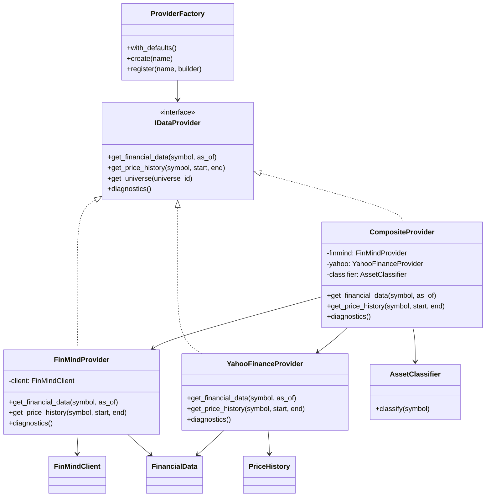
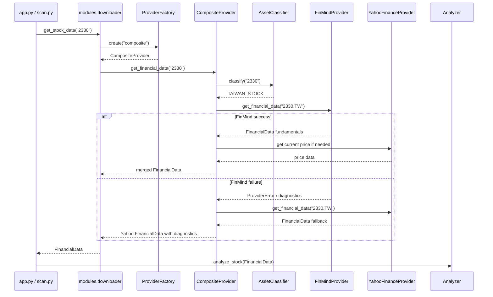
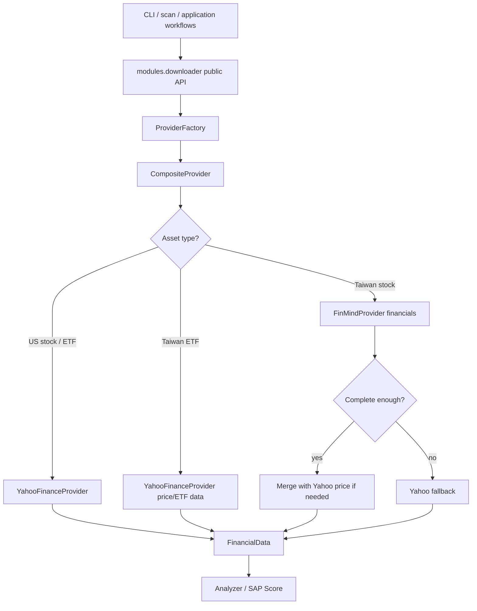

# FinMind First Architecture

Milestone: FinMind First Architecture

This document defines the next data-source direction for StockAnalyzerPro:

```text
FinMind First, Yahoo Finance fallback
```

This Sprint is architecture-only. It does not change Analyzer, Provider implementation, Strategy, SAP Score scoring logic, Backtest, Historical Pipeline, Qualification Logic, or CLI behavior.

## 1. Current Data Flow

Current runtime stock analysis still uses the compatibility downloader API:

```text
app.py / scan.py
        |
        v
modules.downloader.get_stock_data(symbol)
        |
        v
ProviderFactory.with_defaults().create("cached_yahoo")
        |
        v
CachedDataProvider
        |
        v
YahooFinanceProvider
        |
        v
FinancialData
        |
        v
Analyzer / SAP Score / Reports
```

Current historical import flow is separate:

```text
finmind_import.py
        |
        v
FinMindImporter
        |
        v
FinMindClient -> mappers -> HistoricalValidator
        |
        v
HistoricalSnapshotRepository
```

Important current boundaries:

- `Analyzer` receives normalized `FinancialData` and does not know which provider produced it.
- `modules/downloader.py` preserves the public API for existing CLI, scan, and analyzer flows.
- `FinMindImporter` currently writes historical snapshots, not runtime `FinancialData`.
- Yahoo Finance remains the active runtime provider for current single-stock and watchlist analysis.

## 2. Target Data Flow

Target runtime data flow:

```text
app.py / scan.py / future runtime workflows
        |
        v
modules.downloader.get_stock_data(symbol)
        |
        v
ProviderFactory.with_defaults().create("composite")
        |
        v
CompositeProvider
        |
        +-- Taiwan fundamentals -> FinMindProvider
        |
        +-- price / history -> YahooFinanceProvider or future FinMind price path
        |
        +-- fallback fundamentals -> YahooFinanceProvider
        |
        v
FinancialData
        |
        v
Analyzer / SAP Score / Reports
```

Target historical data flow:

```text
FinMindClient
        |
        v
FinMindProvider / FinMindImporter shared mapping layer
        |
        +-- runtime FinancialData
        |
        +-- historical FinancialStatementSnapshot
        |
        v
Historical Repository / Backtest / Qualification
```

The target keeps one normalized model boundary: callers still receive `FinancialData`, `PriceHistory`, or historical snapshot dataclasses. Raw FinMind and yfinance objects must not leak above the provider/importer layer.

## 3. Provider Priority

Provider priority by symbol/data type:

| Symbol / Asset | Financial statements | Revenue | Balance sheet | Cash flow | EPS / shares | Current price | Price history | Historical PIT snapshots |
| --- | --- | --- | --- | --- | --- | --- | --- | --- |
| Taiwan stock | FinMind first | FinMind first | FinMind first | FinMind first | FinMind first | Yahoo fallback/current | Yahoo first initially, FinMind optional later | FinMind first |
| Taiwan ETF | Yahoo first unless FinMind ETF dataset is added | Yahoo fallback/limited | Yahoo fallback/limited | Yahoo fallback/limited | Yahoo fallback/limited | Yahoo first | Yahoo first | Not applicable or future ETF snapshot model |
| US stock | Yahoo first | Yahoo first | Yahoo first | Yahoo first | Yahoo first | Yahoo first | Yahoo first | Future provider |
| US ETF | Yahoo first | Not applicable/limited | Not applicable/limited | Not applicable/limited | Not applicable/limited | Yahoo first | Yahoo first | Not applicable |
| Unknown symbol | Composite detection, then Yahoo fallback | Composite detection, then Yahoo fallback | Composite detection, then Yahoo fallback | Composite detection, then Yahoo fallback | Composite detection, then Yahoo fallback | Yahoo fallback | Yahoo fallback | Not applicable |

Initial target default provider:

```text
ProviderFactory.create("composite")
```

Alias plan:

- `finmind`: direct FinMind-only provider for tests and diagnostics.
- `yahoo`: direct Yahoo provider remains available.
- `cached_yahoo`: legacy runtime-compatible provider remains available during migration.
- `composite`: FinMind-first provider with Yahoo fallback.
- `cached_composite`: future default after cache policy is validated.

## 4. FinMindProvider Design

`FinMindProvider` should implement `IDataProvider`.

Planned location:

```text
data_provider/providers/finmind_provider.py
```

Primary dependencies:

- `data_provider.interfaces.IDataProvider`
- `models.financial_data.FinancialData`
- `models.financial_data.FinancialPeriod`
- `importers.finmind.FinMindClient`
- shared FinMind mapping utilities

Responsibilities:

- Fetch Taiwan financial statement datasets through `FinMindClient`.
- Normalize FinMind rows into `FinancialData`.
- Preserve diagnostics for missing datasets, invalid rows, date fallback, and point-in-time limitations.
- Reuse mapping rules where possible with historical FinMind mappers.
- Avoid repository writes. Runtime provider reads API/cache data only.

Non-responsibilities:

- No SAP Score calculation.
- No Analyzer logic.
- No Backtest logic.
- No direct CLI behavior.
- No historical repository persistence.

Initial methods:

```text
get_financial_data(symbol, as_of=None) -> FinancialData
get_price_history(symbol, start, end) -> PriceHistory
get_universe(universe_id) -> list[str]
diagnostics() -> list[ProviderDiagnostic]
```

Expected MVP behavior:

- `get_financial_data()` supports Taiwan stocks first.
- `get_price_history()` may initially raise a clear provider error or delegate to Yahoo through `CompositeProvider`.
- `get_universe()` may be unsupported in MVP unless FinMind universe metadata is introduced.
- Diagnostics must be queryable after calls.

## 5. Fallback Strategy

`CompositeProvider` owns fallback decisions.

Rules:

```text
if symbol is Taiwan stock:
    try FinMindProvider.get_financial_data(symbol)
    if FinMind returns complete enough FinancialData:
        return FinMind FinancialData enriched with Yahoo price if needed
    if FinMind fails or is incomplete:
        record diagnostic
        return YahooFinanceProvider.get_financial_data(symbol)

if symbol is US stock or ETF:
    return YahooFinanceProvider.get_financial_data(symbol)

if asset type is unknown:
    try Taiwan detection
    otherwise use Yahoo fallback
```

Fallback categories:

| Failure | Fallback? | Diagnostic |
| --- | --- | --- |
| FinMind auth error | Yes | `finmind_auth_failed` |
| FinMind rate limit | Yes | `finmind_rate_limited` |
| FinMind network/server error | Yes | `finmind_unavailable` |
| FinMind empty required dataset | Yes | `finmind_missing_dataset` |
| FinMind partial financials | Conditional | `finmind_partial_data` |
| Mapping error | Yes | `finmind_mapping_failed` |
| Validation/PIT warning | Runtime may continue; historical must mark warning | `finmind_point_in_time_warning` |
| Yahoo fallback also fails | No further fallback in MVP | Combined provider error |

No fallback should be silent. Composite diagnostics must show:

- attempted provider
- selected provider
- fallback reason
- data completeness notes

## 6. Taiwan / US / ETF Detection Rules

Symbol normalization should stay centralized and testable.

Taiwan stock candidates:

- Numeric symbol without suffix, for example `2330`.
- Numeric symbol with `.TW`, for example `2330.TW`.
- Numeric symbol with `.TWO`, for example `6290.TWO`.
- Future Taiwan market metadata from FinMind `TaiwanStockInfo`.

Taiwan ETF candidates:

- Numeric symbol with `.TW` that is listed in an ETF metadata source.
- Common examples may include `0050.TW`, `00878.TW`, `006208.TW`.
- MVP should not infer all numeric `.TW` as ordinary stocks if ETF metadata is available.

US stock candidates:

- Alphabetic symbols without Taiwan suffix, for example `AAPL`, `MSFT`.
- Symbols with US market suffix conventions supported by Yahoo.

US ETF candidates:

- Alphabetic ETF tickers such as `SPY`, `QQQ`, `VOO`.
- ETF classification should come from Yahoo metadata in MVP unless a separate asset classifier is added.

Recommended classifier:

```text
AssetClassifier.classify(symbol) -> AssetType

AssetType:
    TAIWAN_STOCK
    TAIWAN_ETF
    US_STOCK
    US_ETF
    UNKNOWN
```

MVP detection order:

1. Normalize suffix and numeric format.
2. Check Taiwan ETF allowlist/metadata when available.
3. If numeric `.TW` or `.TWO`, classify as Taiwan stock.
4. If alphabetic/no Taiwan suffix, classify as Yahoo-backed US/ETF candidate.
5. If unknown, use Yahoo fallback with diagnostic.

## 7. FinancialData Mapping

FinMind datasets should map into existing `FinancialData` without changing Analyzer.

Target field mapping:

| `FinancialData` / `FinancialPeriod` field | FinMind source |
| --- | --- |
| `symbol` | normalized Taiwan symbol |
| `company_name` | `TaiwanStockInfo` or local fallback map |
| `industry` | `TaiwanStockInfo.industry_category` when available |
| `sector` | `TaiwanStockInfo` category when available |
| `price` | Yahoo current price initially, future FinMind price optional |
| `pe` / `pb` | Yahoo initially or derived when reliable fields exist |
| `current.period` | latest fiscal statement date |
| `current.revenue` | income statement / monthly revenue aggregation when validated |
| `current.net_income` | income statement |
| `current.gross_profit` | income statement |
| `current.operating_income` | income statement |
| `current.total_assets` | balance sheet |
| `current.total_equity` | balance sheet |
| `current.total_debt` | balance sheet |
| `current.long_term_debt` | balance sheet |
| `current.current_assets` | balance sheet |
| `current.current_liabilities` | balance sheet |
| `current.operating_cashflow` | cash flow statement |
| `current.free_cashflow` | cash flow statement or derived |
| `current.shares_outstanding` | share capital / shares field when reliable |
| `current.eps` | income statement EPS or derived |
| `current.book_value_per_share` | derived from equity/shares |
| `previous` | previous fiscal period with same mapping |
| `missing_fields` | mapper completeness checks |
| `diagnostics` | provider diagnostics and fallback notes |

Mapping rules:

- Keep all unit conversions centralized.
- Convert FinMind numeric strings to floats once.
- Keep derived fields deterministic and covered by tests.
- If a field cannot be mapped reliably, set it to `None` and add `missing_fields`.
- Do not modify SAP Score field expectations; adapt provider output to current `FinancialData`.

Point-in-time rules:

- Runtime `FinancialData` may use latest available data for current analysis.
- Historical snapshots must preserve `published_date`, `snapshot_date`, `source`, `source_version`, `is_point_in_time`, and warnings.
- If FinMind lacks official published dates, historical rows must remain research-only unless a reliable timeline engine is introduced.

## 8. Cache Strategy

FinMind-first caching should reuse the existing cache framework.

Cache keys:

```text
provider=finmind
symbol=2330.TW
data_type=financial_data / income_statement / balance_sheet / cashflow / revenue / price_history
period=annual / quarterly / monthly
start_date=...
end_date=...
```

TTL recommendations:

| Data type | TTL |
| --- | --- |
| Company info | 24 hours |
| Financial statements | 7 days |
| Monthly revenue | 1 day after market close; 7 days for historical months |
| Current price | Short TTL or Yahoo runtime path |
| Price history | 1 day |
| Historical snapshots | Permanent or manual refresh |

Implementation path:

- Sprint MVP: MemoryCache through `CachedDataProvider`.
- Next: `cached_composite` with MemoryCache.
- Later: SQLiteCache for FinMind raw/normalized payloads.
- Historical repository remains separate from provider cache.

Cache invalidation:

- Manual invalidate by provider/symbol/data_type.
- Separate invalidation for FinMind financial data and Yahoo price data.
- Do not let stale FinMind cache hide repeated mapping errors; diagnostics should include cache source.

## 9. Failure Handling

Failure handling must be explicit and user-visible through diagnostics/reports.

FinMindProvider failure outputs:

- Raise `ProviderError` for direct provider calls when required data cannot be returned.
- Add `ProviderDiagnostic` entries for partial data.
- Preserve raw exception categories from `FinMindClient` where useful.

CompositeProvider failure outputs:

- If FinMind fails and Yahoo succeeds, return Yahoo data with fallback diagnostics.
- If FinMind partially succeeds and Yahoo fills missing price only, return combined data with source diagnostics.
- If both fail, raise a clear `ProviderError` including both provider names and short reasons.

Historical/PIT failures:

- Missing published date must produce warning.
- `is_point_in_time=False` when official disclosure timing is unavailable.
- Backtest qualification must continue to mark research-only rows as not formal PIT.

User-facing failure categories:

| Category | Example message |
| --- | --- |
| FinMind token missing | FinMind token unavailable; using Yahoo fallback |
| Rate limit | FinMind rate limited; using Yahoo fallback |
| Dataset missing | FinMind balance sheet missing; using Yahoo fallback |
| Mapping incomplete | FinMind data incomplete: current.total_assets missing |
| PIT unsafe | FinMind published_date unavailable; snapshot is research-only |

## 10. Migration Plan

Architecture-only Sprint:

- Add this document.
- Update README, CHANGELOG, and PROJECT_STATUS.
- Do not change runtime provider selection.

Suggested implementation sprints:

1. `FinMindProvider Skeleton`
   - Add `data_provider/providers/finmind_provider.py`.
   - Implement metadata, constructor, diagnostics, and unsupported method behavior.
   - Add unit tests with mock `FinMindClient`.

2. `FinMind FinancialData Mapping`
   - Add mapping from FinMind response rows to `FinancialData`.
   - Support current/previous fiscal periods.
   - Add fixture-based unit tests.

3. `Asset Classifier`
   - Add Taiwan/US/ETF detection helper.
   - Add tests for numeric Taiwan symbols, `.TW`, `.TWO`, US tickers, and ETF examples.

4. `CompositeProvider MVP`
   - Add FinMind-first financial data path for Taiwan stocks.
   - Preserve Yahoo for price and non-Taiwan assets.
   - Add fallback diagnostics.

5. `ProviderFactory Integration`
   - Register `finmind`, `composite`, and optionally `cached_composite`.
   - Keep `cached_yahoo` available.
   - Switch downloader only after tests prove CLI and scan compatibility.

6. `Cache and Diagnostics Hardening`
   - Add FinMind cache keys and TTL tests.
   - Add report diagnostics for provider source and fallback.

7. `Historical PIT Alignment`
   - Reuse FinMind mapping for historical snapshots where appropriate.
   - Keep qualification logic as the authoritative PIT gate.

Rollback plan:

- Keep `cached_yahoo` provider alias unchanged.
- Keep downloader public API unchanged.
- Use a config flag or provider name to switch default provider.
- If FinMind fails in production, CompositeProvider falls back to Yahoo and records diagnostics.

## 11. Unit Test Plan

Provider tests:

- `FinMindProvider` initializes with mock client.
- Taiwan symbol financial statements map to `FinancialData`.
- Missing FinMind dataset creates diagnostics.
- FinMind API error raises `ProviderError` for direct provider use.

Composite tests:

- Taiwan stock uses FinMind for financial data.
- Taiwan stock uses Yahoo for current price when FinMind has no price path.
- FinMind failure falls back to Yahoo.
- US stock uses Yahoo directly.
- ETF uses Yahoo directly.
- Diagnostics include selected provider and fallback reason.

Classifier tests:

- `2330` -> Taiwan stock.
- `2330.TW` -> Taiwan stock.
- `6290.TWO` -> Taiwan stock.
- Known Taiwan ETF allowlist -> Taiwan ETF.
- `AAPL` -> US stock candidate.
- `SPY` / `QQQ` -> US ETF candidate.
- Unknown symbols produce deterministic fallback behavior.

Cache tests:

- FinMind financial data cache hit.
- FinMind cache miss.
- Expired FinMind cache refetches.
- Composite cache key separates FinMind financials from Yahoo price.

Regression tests:

- `app.py` single-stock analysis still works through downloader API.
- `scan.py --watchlist` still works.
- Analyzer receives `FinancialData` only.
- SAP Score output remains unchanged for same input fixtures.
- No network calls in unit tests.

## 12. Mermaid Diagram

### Target Provider Class Diagram



### Runtime Sequence Diagram



### Target Data Flow



## 13. Code Review Checklist

Architecture checklist:

- [ ] Runtime default provider change is behind `ProviderFactory`.
- [ ] `modules/downloader.py` public API remains stable.
- [ ] Analyzer receives only `FinancialData`.
- [ ] FinMind raw rows do not leak above provider/importer layers.
- [ ] Yahoo provider remains available and tested.
- [ ] Composite fallback is explicit and diagnostic-rich.
- [ ] Taiwan/US/ETF classifier behavior is deterministic.
- [ ] Unit tests use mock FinMind/Yahoo clients only.
- [ ] No real FinMind API calls in unit tests.
- [ ] Cache keys separate provider, symbol, data type, and date ranges.
- [ ] Historical PIT data continues through repository/qualification rules.
- [ ] Missing published dates remain research-only for historical validation.
- [ ] SAP Score scoring logic is unchanged.
- [ ] Backtest strategy logic is unchanged.
- [ ] CLI and reports keep existing user workflows.

Implementation checklist for future sprints:

- [ ] Add `FinMindProvider` skeleton before wiring runtime.
- [ ] Add `CompositeProvider` tests before changing downloader default.
- [ ] Keep `cached_yahoo` alias as rollback path.
- [ ] Add source/fallback diagnostics to reports only after provider behavior is stable.
- [ ] Confirm watchlist scan, sample scan, single-stock analysis, backtest, strategy compare, and research report still pass.
