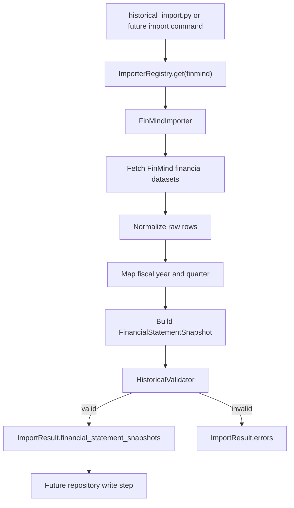
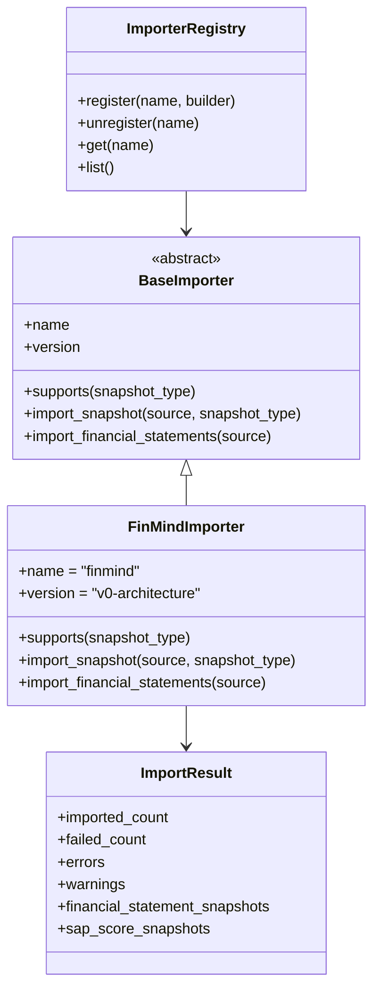
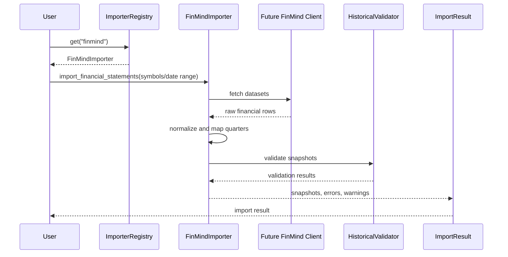

# FinMind Importer Architecture

Milestone 5.7 Sprint 1 defines the FinMind importer architecture only.

This Sprint does not call the FinMind API, does not fetch network data, and does not write to `HistoricalSnapshotRepository`.

## Goals

- Add a future `FinMindImporter` under the historical import framework.
- Define how FinMind financial statement data will map into historical snapshots.
- Preserve point-in-time safety requirements before implementation.
- Keep Analyzer, Provider, Strategy, Backtest, SAP Score, and Historical Repository unchanged.

## FinMind API Mapping

Planned FinMind datasets:

| FinMind Dataset | Planned Use | Snapshot Output |
| --- | --- | --- |
| `TaiwanStockFinancialStatements` | Income statement metrics such as revenue, gross profit, operating income, net income, EPS | `FinancialStatementSnapshot` |
| `TaiwanStockBalanceSheet` | Assets, liabilities, equity, cash, inventory, receivables | `FinancialStatementSnapshot` |
| `TaiwanStockCashFlowsStatement` | Operating cash flow, investing cash flow, financing cash flow, free cash flow inputs | `FinancialStatementSnapshot` |
| `TaiwanStockInfo` | Symbol metadata and market classification | metadata enrichment only |

Planned importer names:

- `finmind`
- Future aliases may include `finmind_tw` if multi-market imports are introduced.

## Financial Statement Mapping

FinMind raw rows should be grouped into one snapshot payload per:

- `symbol`
- `fiscal_year`
- `fiscal_quarter`
- `statement_type`
- `published_date`
- `snapshot_date`
- `source`
- `source_version`

Planned statement types:

- `income_statement`
- `balance_sheet`
- `cashflow_statement`

MVP payload strategy:

- Store normalized statement fields in `payload_json`.
- Keep raw FinMind field names in a `raw` object only when needed for auditability.
- Preserve `source="finmind"` and a FinMind dataset/version marker in `source_version`.

## Quarter Mapping

FinMind reports use period dates that must be converted into fiscal periods.

Planned mapping:

| Statement Date Month | Fiscal Quarter |
| --- | --- |
| 03 | 1 |
| 06 | 2 |
| 09 | 3 |
| 12 | 4 |

Rules:

- `fiscal_year` comes from `statement_date.year`.
- `fiscal_quarter` comes from the statement date month.
- Non-quarter-end statement dates are rejected or normalized only after an explicit data-quality rule is added.
- `published_date` must come from a disclosure date, filing date, or the closest reliable FinMind availability date.
- `snapshot_date` must be on or after `published_date`.

## Snapshot Generation Flow

Planned flow:

## Rate Limit Strategy

The future implementation should:

- Centralize all FinMind HTTP calls behind a small client object.
- Use configurable request spacing.
- Batch symbols conservatively.
- Record rate-limit responses as importer diagnostics.
- Avoid retry storms when API quota is exhausted.

Initial defaults should favor reliability over speed:

- Sequential requests by symbol and dataset.
- Small sleep between requests.
- Configurable maximum requests per minute.

## Retry Strategy

Retry only transient failures:

- HTTP 429 rate limit responses.
- HTTP 500/502/503/504 server errors.
- Temporary network timeouts.

Do not retry:

- Authentication failures.
- Invalid dataset names.
- Invalid symbols.
- Validation failures after data is received.

Planned retry behavior:

- Exponential backoff with jitter.
- Low maximum attempts, for example 3.
- Preserve failed symbol and dataset details in `ImportResult.errors`.

## Error Handling

Error categories:

| Category | Handling |
| --- | --- |
| API unavailable | Record error, skip affected symbol/dataset |
| Rate limited | Retry if budget remains, then fail cleanly |
| Empty data | Warning if symbol exists, error if required dataset is missing |
| Invalid schema | Error with missing/unknown field names |
| Invalid quarter mapping | Validation failure |
| Invalid point-in-time date | Validation failure |

The importer must not partially hide failures. Every skipped symbol or dataset should be visible in `ImportResult.errors` or `ImportResult.warnings`.

## Point-in-Time Considerations

Point-in-time safety depends on `published_date`, not only `statement_date`.

Rules:

- `snapshot_date` must never be earlier than `published_date`.
- Historical backtests should only use snapshots where `published_date <= rebalance_date`.
- If FinMind does not expose a reliable disclosure date for a field, the snapshot should be marked with a warning.
- `is_point_in_time=True` is allowed only when the data source and published date are reliable.
- Proxy or inferred dates must be marked as warnings and should not receive grade `A` credibility.

## UML Class Diagram

## Sequence Diagram

## Future Migration Plan

Sprint plan:

- Sprint 2: define FinMind client interface and test fixtures.
- Sprint 3: implement offline fixture-based FinMind importer behavior.
- Sprint 4: add opt-in FinMind HTTP client with token handling.
- Sprint 5: integrate FinMind importer with historical import CLI behind explicit flags.
- Sprint 6: add repository write and data quality profiling workflow.
- Sprint 7: validate point-in-time backtest integration after historical coverage is sufficient.

Implementation guardrails:

- No network calls in unit tests.
- No implicit FinMind API usage from Analyzer, Provider, Backtest, or Strategy.
- FinMind imports must remain explicit user actions.
- All imported rows must pass `HistoricalValidator` before repository writes.
