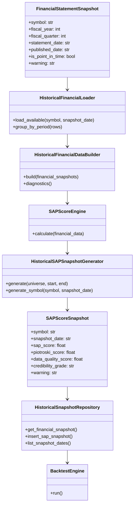
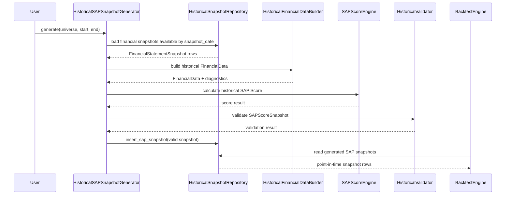
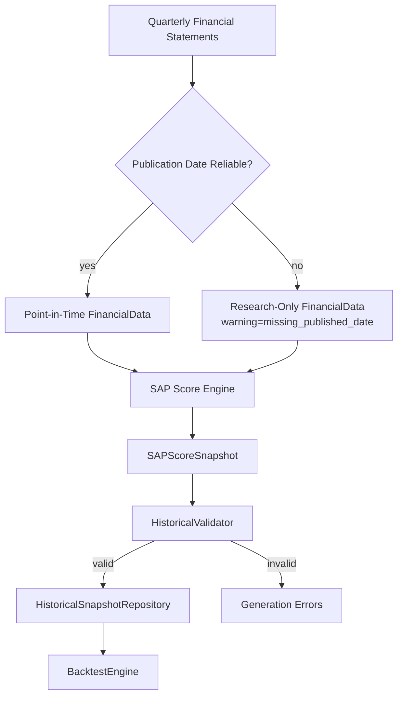
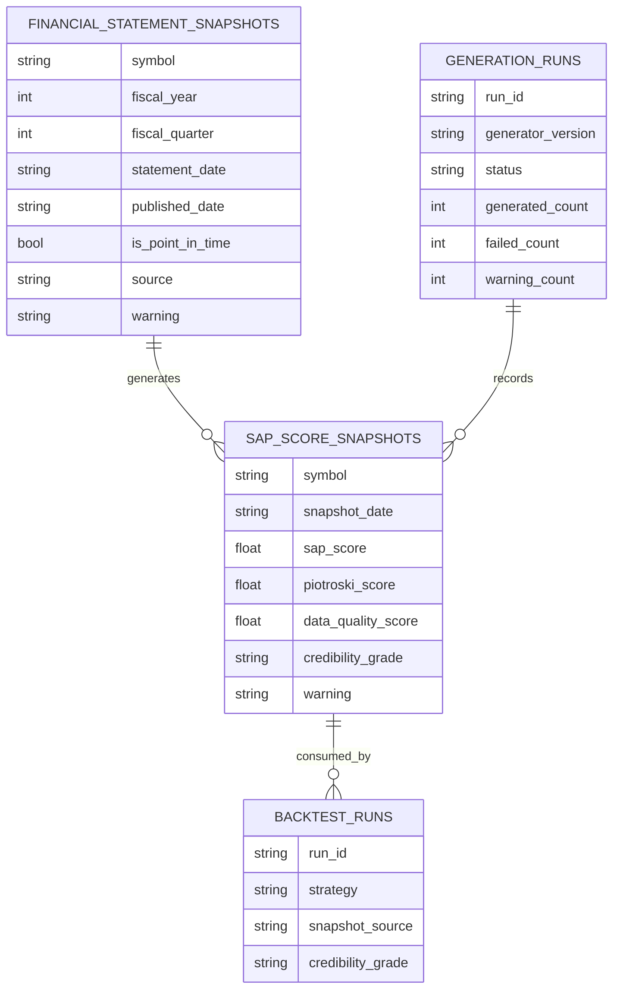

# Historical SAP Snapshot Generator Architecture

Milestone 6 Sprint 1 defines the architecture for a real Historical SAP Snapshot Generator.

This document is architecture design only. It does not modify analyzer, SAP Score, provider, importer, repository, backtest, strategy, CLI, or runtime behavior.

## Goals

- Generate historical SAP score snapshots from quarter-level financial statements.
- Preserve point-in-time safety by using only data available at each snapshot date.
- Separate snapshot generation from backtest execution.
- Make generated historical snapshots reproducible, auditable, and suitable for research.
- Provide a migration path from current proxy/current-analysis snapshots to real historical SAP snapshots.

## Non-Goals

- Do not implement generator code in this Sprint.
- Do not modify SAP Score calculation.
- Do not modify Analyzer.
- Do not modify BacktestEngine.
- Do not change current FinMind importer behavior.
- Do not claim formal investment performance until point-in-time publication dates are reliable.

## 1. Target Flow

The target data flow is:

```text
Quarterly Financial
↓
SAP Score Engine
↓
Historical Snapshot
↓
Repository
↓
Backtest
```

Responsibilities:

- Quarterly Financial: durable financial statement snapshots by symbol, fiscal year, fiscal quarter, statement type, source, and publication metadata.
- SAP Score Engine: deterministic scoring path using historical financial inputs only.
- Historical Snapshot: generated `SAPScoreSnapshot` rows with score, data quality, credibility, warning, and point-in-time metadata.
- Repository: persistence layer for generated snapshots and source provenance.
- Backtest: consumes generated snapshots without calling live analyzer or provider logic.

Design rule:

Historical backtests must consume generated historical snapshots, not current live analysis.

## 2. Snapshot Generation Pipeline

The generator converts validated financial statement snapshots into historical SAP score snapshots.

Pipeline:

```text
select universe
select snapshot_date range
load financial statements available by snapshot_date
group by symbol and fiscal period
build historical FinancialData input
run SAP Score Engine
build SAPScoreSnapshot
validate SAPScoreSnapshot
write to HistoricalSnapshotRepository
emit run diagnostics
```

Inputs:

- Symbol universe.
- Snapshot date range.
- `FinancialStatementSnapshot` rows from `HistoricalSnapshotRepository`.
- Point-in-time availability metadata.
- SAP scoring rules and current analyzer-compatible financial data structures.

Outputs:

- `SAPScoreSnapshot` rows.
- Generation summary report.
- Diagnostics for missing statements, missing fields, fallback dates, duplicate rows, and non-point-in-time inputs.

Failure behavior:

- Missing required financial statements: skip symbol/date or write a failed diagnostic; do not guess.
- Missing publication date: allow research-only generation with warning, but mark as not point-in-time.
- Invalid financial data: fail the row and record a clear error.
- Partial data: generate only when SAP Score Engine can produce a defensible result and data quality is recorded.

## 3. Point-in-Time Rule

A generated SAP snapshot is point-in-time safe only when every source financial statement satisfies:

```text
published_date <= snapshot_date
is_point_in_time = true
warning does not include missing_published_date
```

If any source statement lacks a reliable announcement date:

```text
is_point_in_time = false
warning includes missing_published_date or derived_publication_date
credibility_grade cannot be A
```

Rules:

- `statement_date` describes the fiscal period; it is not the publication date.
- `published_date` or an equivalent announcement date controls when data becomes usable.
- Snapshot generation must never select statements merely because the fiscal period ended before the snapshot date.
- Rows created from fallback dates are valid for research pipeline testing, but not for formal look-ahead-safe performance claims.
- Backtest reports must preserve snapshot warnings and credibility grade.

## 4. Publication Timeline

Historical snapshot generation needs a conservative publication timeline.

Timeline fields:

| Field | Meaning | Point-in-Time Role |
| --- | --- | --- |
| `statement_date` | Fiscal period end date | Period identity only |
| `published_date` | Official announcement or filing date | Primary availability date |
| `snapshot_date` | Date the generated snapshot represents | Must be on or after publication |
| `created_at` | Date StockAnalyzerPro generated or imported the row | Audit metadata only |

Example:

```text
statement_date = 2024-12-31
published_date = 2025-03-20
snapshot_date = 2025-03-31
```

This is point-in-time safe only if the source publication date is reliable and the snapshot is generated using data known on or before `2025-03-31`.

Fallback example:

```text
statement_date = 2024-12-31
published_date = 2024-12-31
warning = missing_published_date
is_point_in_time = false
```

This row can be imported and profiled, but it must not be treated as formal point-in-time data.

## 5. Historical Rebuild

Historical rebuild regenerates SAP score snapshots from stored financial statement snapshots.

Use cases:

- Initial generation for a new historical universe.
- SAP Score Engine bug fix after review.
- Data quality rule update.
- Publication-date correction.
- Source payload backfill or restatement.

Rebuild inputs:

- Symbol universe.
- Snapshot date range.
- Generator version.
- SAP Score Engine version.
- Source filter, such as FinMind or CSV.

Rebuild behavior:

- Existing generated snapshots are not silently overwritten.
- Each rebuild creates a generation run record.
- Rebuild output includes counts for generated, skipped, failed, warning, and non-point-in-time rows.
- Rebuild should be deterministic for the same source data and generator version.

Proposed generation run metadata:

```text
run_id
generator_version
sap_engine_version
source_filter
snapshot_start
snapshot_end
started_at
finished_at
status
generated_count
failed_count
warning_count
non_point_in_time_count
```

## 6. Incremental Update

Incremental update regenerates only affected symbols and snapshot dates.

Triggers:

- New financial statement snapshot imported.
- Existing source row corrected with a reliable `published_date`.
- Source warning changes.
- SAP Score Engine version changes.
- Generator logic version changes.

Affected scope:

```text
symbol = changed symbol
snapshot_date >= changed published_date
until next newer statement for same symbol/type/fiscal period supersedes it
```

Incremental rules:

- If source financial payload hash is unchanged, skip regeneration.
- If publication timeline changes, recalculate affected point-in-time status.
- If a row changes from `missing_published_date` to formal `published_date`, regenerate credibility and warnings.
- Incremental runs must be auditable the same way as full rebuilds.

## 7. Mermaid UML

### Class Diagram



### Sequence Diagram



### Pipeline Diagram



### Data Lineage



## 8. Migration Plan

Sprint 2: Historical SAP Generator Schema

- Design generation run metadata schema.
- Decide whether `SAPScoreSnapshot` needs source statement references.
- Add schema tests only.

Sprint 3: Historical FinancialData Builder Design

- Define how `FinancialStatementSnapshot.payload_json` maps to analyzer-compatible `FinancialData`.
- Document required fields and data quality diagnostics.
- Do not change Analyzer.

Sprint 4: Generator MVP

- Implement generator using deterministic fixtures.
- Generate `SAPScoreSnapshot` rows without changing SAP Score logic.
- Add unit tests with mock financial snapshots.

Sprint 5: Repository Integration

- Write generated SAP snapshots into `HistoricalSnapshotRepository`.
- Add generation summary report.
- Keep backtest unchanged.

Sprint 6: Backtest Snapshot Source

- Add a read path for generated SAP snapshots.
- Preserve existing CSV snapshot compatibility.
- Keep Strategy and SAP Score unchanged.

Sprint 7: Incremental Update

- Add symbol/date affected-range detection.
- Add generator version and rebuild tracking.
- Add diagnostics for changed publication timelines.

Sprint 8: Real Data Qualification

- Use FinMind imported financial statements.
- Separate `missing_published_date` research rows from point-in-time-safe rows.
- Update credibility reporting only after validation.

## 9. Code Review

Architecture review:

- The generator must be an application/historical orchestration layer, not part of Analyzer.
- Analyzer and SAP Score Engine must not import repository, importer, or backtest modules.
- Backtest must consume generated snapshots and must not call live analyzer for historical scoring.
- Repository must remain persistence-focused.
- Source warnings must be preserved from financial statement snapshots into generated SAP snapshots.

Point-in-time review:

- Does every generated snapshot record whether it is point-in-time safe?
- Does every generated snapshot carry publication-date warnings?
- Are fallback publication dates marked as research-only?
- Can the backtest report distinguish formal point-in-time snapshots from fallback snapshots?

Testing review:

- Unit tests must use deterministic financial snapshot fixtures.
- Network calls must not appear in unit tests.
- Generator tests should cover full generation, missing fields, fallback publication dates, invalid rows, duplicate snapshots, and incremental updates.
- Smoke tests should use a test database only.

Risk review:

- FinMind financial statements can currently import successfully, but rows without announcement dates are not formal point-in-time data.
- A historical SAP generator must not upgrade credibility for fallback rows.
- Restatements and vendor corrections require generation run provenance.
- Mixing proxy, fallback, and true point-in-time snapshots must remain visible in reports.

Decision:

Implement the Historical SAP Snapshot Generator only after the financial statement to historical `FinancialData` mapping is designed and reviewed. The first implementation should generate research snapshots with conservative warnings before any backtest credibility upgrade.
