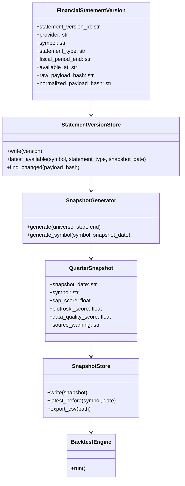
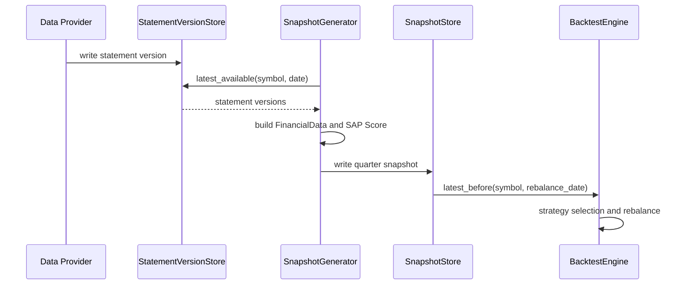
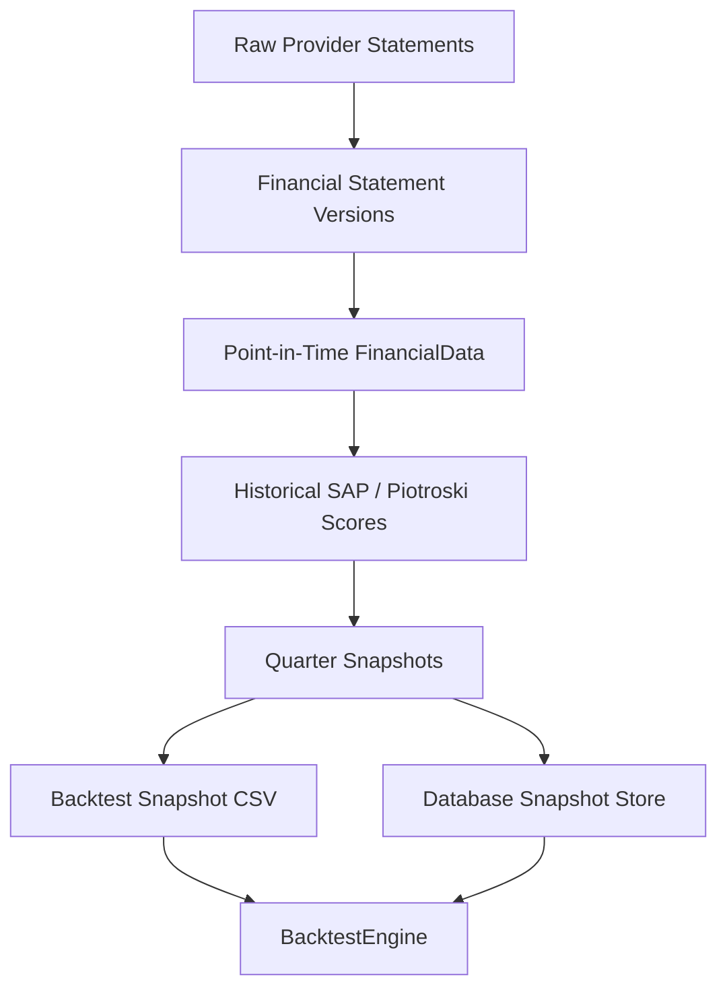
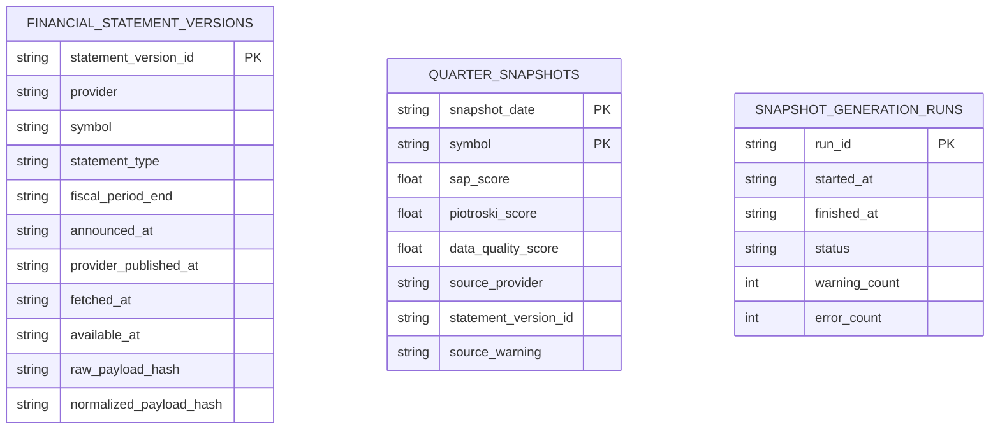

# Historical Snapshot Architecture

Milestone 5 Sprint 1 defines the point-in-time historical snapshot architecture
for StockAnalyzerPro.

This document is architecture design only. It does not change provider,
downloader, analyzer, strategy, SAP Score, cache, backtest, reports, or runtime
behavior.

## Goals

- Build a real point-in-time snapshot system for historical strategy research.
- Replace current proxy snapshots with quarter-based records created only from
  financial statements known by each snapshot date.
- Preserve statement versioning, provider source, fetch time, and announcement
  dates.
- Make backtests reproducible without live analyzer calls.
- Support incremental updates as new filings become available.
- Keep snapshot generation separate from strategy logic.

## Non-Goals

- Do not implement database tables in this sprint.
- Do not modify current SAP Score calculation.
- Do not modify BacktestEngine.
- Do not add new providers in this sprint.
- Do not claim formal historical performance until the point-in-time pipeline is
  implemented and validated.

## 1. Quarter Snapshot

A quarter snapshot is the strategy input available at a specific historical
quarter boundary.

Example snapshot dates:

```text
2023-03-31
2023-06-30
2023-09-30
2023-12-31
```

Snapshot responsibilities:

- Store one row per `snapshot_date` and `symbol`.
- Include calculated strategy inputs such as SAP Score, Piotroski score, data
  quality score, valuation fields, growth fields, and diagnostics.
- Use only financial statements with `available_at <= snapshot_date`.
- Record whether a row is complete, partial, stale, or unavailable.
- Preserve the source statement version used for each calculated row.

Proposed snapshot row:

```text
snapshot_date
symbol
sap_score
piotroski_score
data_quality_score
price
fair_price
reasonable_buy
first_target_price
source_provider
statement_version_id
source_warning
created_at
```

Design rule:

Quarter snapshots are analysis artifacts. They are not raw statements. Raw
statements must remain separately versioned so snapshots can be regenerated.

## 2. Financial Statement Versioning

Financial statement versioning is required because historical financial data can
change after restatement, correction, vendor backfill, or schema update.

Each statement version should preserve:

- Provider name.
- Symbol.
- Fiscal period.
- Statement type.
- Filing date or announcement date.
- Date the project first fetched the statement.
- Date the data became available for point-in-time use.
- Raw payload hash.
- Normalized payload hash.
- Provider warning or diagnostics.

Statement types:

- Income statement.
- Balance sheet.
- Cashflow statement.
- Company profile or metadata when needed.

Important dates:

- `fiscal_period_end`: period the statement describes.
- `announced_at`: official announcement or filing date when available.
- `provider_published_at`: provider timestamp when available.
- `fetched_at`: when StockAnalyzerPro downloaded the payload.
- `available_at`: conservative point-in-time date used by backtests.

Date priority:

```text
available_at =
    announced_at
    else provider_published_at
    else fetched_at with warning
```

Design rule:

Backtests must select statements by `available_at`, not by fiscal period alone.

## 3. Point-in-Time Database

The point-in-time database stores raw statements, normalized statements, and
generated snapshots. SQLite is sufficient for the MVP. DuckDB may be considered
later for larger analytical workloads.

Proposed tables:

```sql
CREATE TABLE financial_statement_versions (
    statement_version_id TEXT PRIMARY KEY,
    provider TEXT NOT NULL,
    symbol TEXT NOT NULL,
    statement_type TEXT NOT NULL,
    fiscal_period_end TEXT NOT NULL,
    announced_at TEXT,
    provider_published_at TEXT,
    fetched_at TEXT NOT NULL,
    available_at TEXT NOT NULL,
    raw_payload_json TEXT NOT NULL,
    raw_payload_hash TEXT NOT NULL,
    normalized_payload_json TEXT NOT NULL,
    normalized_payload_hash TEXT NOT NULL,
    source_warning TEXT,
    created_at TEXT NOT NULL
);

CREATE TABLE quarter_snapshots (
    snapshot_date TEXT NOT NULL,
    symbol TEXT NOT NULL,
    sap_score REAL,
    piotroski_score REAL,
    data_quality_score REAL,
    price REAL,
    fair_price REAL,
    reasonable_buy REAL,
    first_target_price REAL,
    source_provider TEXT NOT NULL,
    statement_version_id TEXT,
    source_warning TEXT,
    created_at TEXT NOT NULL,
    PRIMARY KEY (snapshot_date, symbol)
);

CREATE TABLE snapshot_generation_runs (
    run_id TEXT PRIMARY KEY,
    started_at TEXT NOT NULL,
    finished_at TEXT,
    snapshot_start TEXT,
    snapshot_end TEXT,
    provider TEXT,
    status TEXT NOT NULL,
    warning_count INTEGER NOT NULL DEFAULT 0,
    error_count INTEGER NOT NULL DEFAULT 0
);
```

Database rules:

- Do not overwrite statement versions.
- Do not silently overwrite snapshots without recording a generation run.
- Use content hashes to detect unchanged payloads.
- Store warnings rather than hiding missing point-in-time metadata.

## 4. Snapshot Generator

`SnapshotGenerator` converts versioned statement data into quarter snapshots.

Inputs:

- Universe.
- Snapshot date range.
- Statement version store.
- Price source, if price-dependent valuation is included.
- Analyzer or scoring pipeline.

Outputs:

- `quarter_snapshots` rows.
- Generation diagnostics.
- Run metadata.

Processing flow:

```text
for each snapshot_date:
    for each symbol:
        load latest statements where available_at <= snapshot_date
        normalize into FinancialData
        calculate SAP Score / Piotroski / valuation / growth
        write quarter_snapshots row
```

Failure handling:

- Missing latest statement: write unavailable row or skip with diagnostics.
- Partial fields: calculate available scores and record data quality warning.
- Provider warning: propagate into `source_warning`.
- No point-in-time date: use conservative fallback only with warning.

Design rule:

Snapshot generation may call analyzer/scoring logic. Backtest should consume the
generated snapshot rows and should not call current live analyzer.

## 5. Historical SAP Score Pipeline

The historical SAP Score pipeline is the formal path from raw financial
statements to backtest-ready snapshots.

Pipeline stages:

1. Fetch historical statements.
2. Version raw and normalized payloads.
3. Resolve `available_at`.
4. Build point-in-time `FinancialData`.
5. Calculate Piotroski, valuation, growth, and SAP Score.
6. Write quarter snapshot.
7. Validate row quality and point-in-time safety.
8. Export snapshot CSV for current BacktestEngine compatibility.

Compatibility output:

```text
date,symbol,sap_score,piotroski_score,data_quality_score,source,warning
```

This preserves current backtest snapshot compatibility while the richer database
schema evolves.

Quality gates:

- Every row must indicate source provider.
- Every row must indicate whether data is point-in-time safe.
- Rows generated from `fetched_at` fallback must carry warning.
- Rows with missing statement version IDs must not receive high credibility.

## 6. Incremental Update

Incremental update prevents full rebuilds when only a few new filings arrive.

Update triggers:

- New provider payload for a symbol.
- Changed payload hash.
- New fiscal period.
- Corrected announcement date.
- New price history needed for snapshot valuation.

Incremental flow:

```text
fetch provider payload
compute payload hash
if hash exists:
    skip statement write
else:
    write new statement version
    identify affected snapshot dates
    regenerate only affected symbol/date snapshots
```

Affected snapshot dates:

- Snapshot dates after `available_at`.
- Snapshot dates until the next newer statement becomes available.
- Strategy-specific windows if future strategies need trailing history.

Design rules:

- Incremental update must be deterministic.
- Regeneration must record run metadata.
- Old snapshot rows can be replaced only by a new generation run with traceable
  provenance.

## 7. Backtest Integration

Backtest should consume historical snapshots, not raw statements.

Target flow:

```text
SnapshotGenerator
  -> quarter_snapshots table
  -> export generated historical snapshot CSV
  -> BacktestEngine SnapshotScoreStore
  -> Strategy.select_stocks
  -> Portfolio rebalance
```

Integration plan:

- Keep current `SnapshotScoreStore` CSV format during initial integration.
- Add a database-backed snapshot store later.
- Backtest credibility should improve only when snapshots are confirmed
  point-in-time safe.
- Current proxy warnings should remain visible until replaced by real
  historical snapshots.

Backtest rules:

- Strategy receives only rows available on or before rebalance date.
- Backtest does not call live downloader.
- Backtest does not call current analyzer.
- Backtest report includes snapshot source and point-in-time status.

## 8. Migration Plan

Sprint 2: Historical Snapshot Schema

- Add SQLite schema for statement versions and quarter snapshots.
- Add migration helper.
- Add tests for schema creation.

Sprint 3: Statement Version Store

- Implement read/write for financial statement versions.
- Add payload hashing.
- Add point-in-time date resolution.

Sprint 4: Snapshot Generator MVP

- Generate quarter snapshots from stored statement versions.
- Export current-compatible snapshot CSV.
- Add unit tests with deterministic fixture statements.

Sprint 5: Backtest Snapshot Integration

- Add database-backed or generated CSV snapshot source.
- Keep existing BacktestEngine behavior stable.
- Update credibility grading to distinguish proxy vs real point-in-time
  snapshots.

Sprint 6: Incremental Update

- Add hash-based skip logic.
- Regenerate affected snapshots only.
- Add run metadata and diagnostics.

## 9. Mermaid UML

### Class Diagram



### Sequence Diagram



### Data Flow



### ER Diagram



## 10. Code Review

Maintainability:

- Statement versions and quarter snapshots are separate, which keeps raw data
  auditability independent from generated strategy artifacts.
- `available_at` centralizes point-in-time safety and prevents accidental use of
  future filings.
- Snapshot generation is isolated from backtest execution, reducing live-data
  leakage risk.
- Current CSV snapshot compatibility allows incremental adoption.

Extensibility:

- Additional providers can write statement versions through the same store.
- Future strategies can reuse quarter snapshots or request strategy-specific
  historical features.
- SQLite is enough for MVP, while DuckDB can be added later if analytical volume
  grows.
- Incremental update can scale without regenerating all historical snapshots.

Risks:

- Announcement dates may be missing or unreliable from some providers.
- Restatements can change historical values and require careful provenance.
- Snapshot credibility must remain conservative until all dates are audited.
- Mixing proxy snapshots and point-in-time snapshots can confuse reports unless
  warnings are explicit.

Decision:

The system should implement statement versioning before replacing proxy
snapshots. Backtest credibility should not be upgraded until snapshots are
generated from auditable statement versions with conservative `available_at`
dates.
