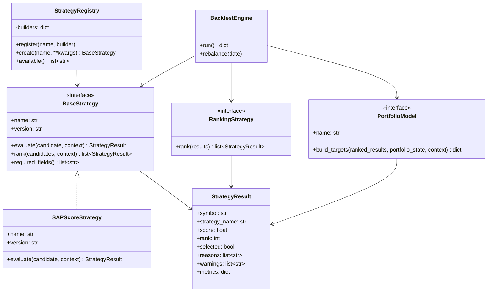
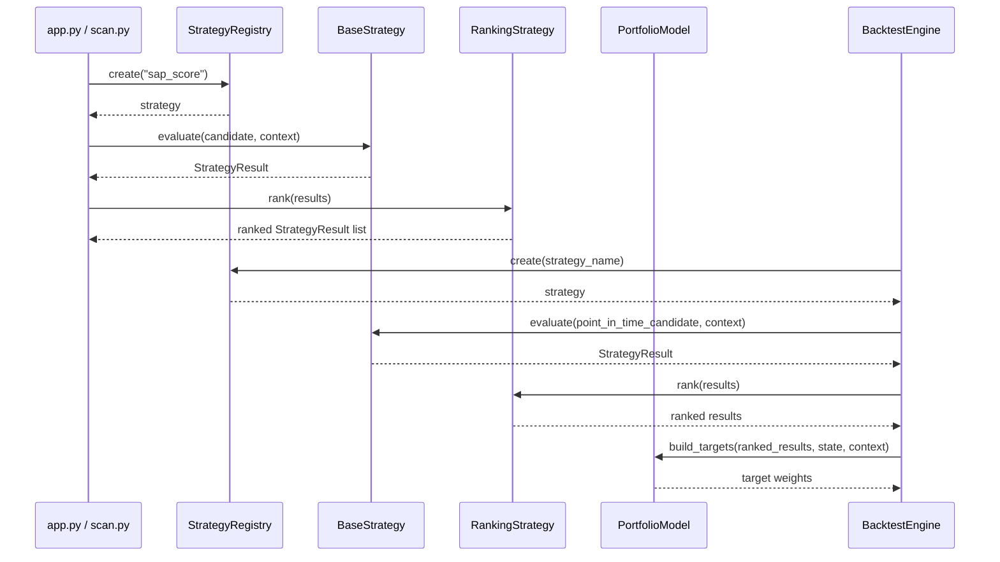
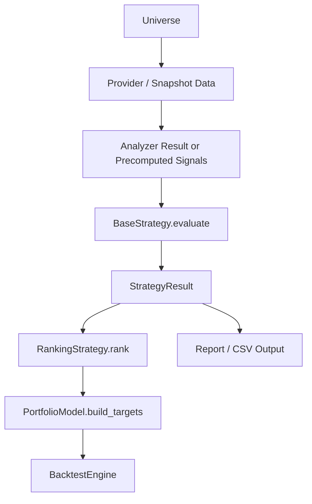

# Strategy Framework Architecture

Milestone 4 Sprint 1 defines the strategy framework architecture for
StockAnalyzerPro.

This document is architecture design only. It does not change analyzer,
provider, downloader, cache, SAP Score, backtest, report, or runtime behavior.

## Goals

- Establish one interface for investment strategies.
- Separate strategy rules from data loading, scoring, reporting, and portfolio
  execution.
- Support multiple ranking strategies without rewriting scan or backtest logic.
- Make strategy selection explicit and testable.
- Keep the current SAP Score workflow usable while preparing for future
  strategies.
- Provide clear extension points for ranking, portfolio construction, and
  backtest integration.

## Non-Goals

- Do not change existing strategy code in this sprint.
- Do not modify SAP Score weights.
- Do not modify `modules/analyzer.py`.
- Do not modify `backtest/strategy.py`.
- Do not add new provider integrations.
- Do not add machine learning or optimizer logic.

## 1. BaseStrategy

`BaseStrategy` is the stable contract for every investment strategy. A strategy
receives normalized stock analysis inputs and returns deterministic ranking or
selection outputs.

Proposed responsibilities:

- Declare strategy identity and version.
- Validate required input fields.
- Score or rank candidate stocks.
- Explain why a stock passed, failed, or was skipped.
- Produce a `StrategyResult` that downstream tools can consume.

Proposed interface:

```python
class BaseStrategy:
    name: str
    version: str

    def evaluate(self, candidate: dict, context: StrategyContext) -> StrategyResult:
        raise NotImplementedError

    def rank(self, candidates: list[dict], context: StrategyContext) -> list[StrategyResult]:
        raise NotImplementedError

    def required_fields(self) -> list[str]:
        raise NotImplementedError
```

Design notes:

- `candidate` can initially be a scan/analyzer result dict.
- Future implementation can replace dicts with typed models once the project
  stabilizes the analysis output contract.
- `context` carries runtime parameters such as date, universe name, minimum data
  quality, and backtest mode.
- Strategy code should not download data.
- Strategy code should not write reports.
- Strategy code should not mutate portfolio state directly.

## 2. StrategyRegistry

`StrategyRegistry` maps strategy names to strategy builders. It keeps app,
scan, and backtest code from importing concrete strategies directly.

Responsibilities:

- Register strategy classes or builder functions.
- Create strategy instances by name.
- List available strategies.
- Provide clear errors for unknown strategy names.
- Support future CLI selection.

Proposed interface:

```python
class StrategyRegistry:
    def register(self, name: str, builder: Callable[..., BaseStrategy]) -> None:
        raise NotImplementedError

    def create(self, name: str, **kwargs) -> BaseStrategy:
        raise NotImplementedError

    def available(self) -> list[str]:
        raise NotImplementedError
```

Default registry candidates:

- `sap_score`: current SAP Score ranking strategy.
- `piotroski`: future Piotroski-only strategy.
- `value`: future valuation-focused strategy.
- `quality_growth`: future quality and growth strategy.

Design rule:

The registry should be a wiring layer only. It should not contain investment
logic.

## 3. StrategyResult

`StrategyResult` is the normalized output from any strategy. It lets scan,
report, and backtest consume different strategy rules through the same shape.

Proposed model:

```python
@dataclass
class StrategyResult:
    symbol: str
    strategy_name: str
    score: float | None
    rank: int | None = None
    selected: bool = False
    reasons: list[str] = field(default_factory=list)
    warnings: list[str] = field(default_factory=list)
    metrics: dict = field(default_factory=dict)
```

Field rules:

- `symbol`: normalized stock symbol.
- `strategy_name`: source strategy name.
- `score`: primary comparable score, higher is better unless the strategy
  declares otherwise.
- `rank`: rank after sorting a universe.
- `selected`: whether the candidate passes the strategy selection rule.
- `reasons`: human-readable explanation for positive decisions.
- `warnings`: data quality or rule warnings.
- `metrics`: strategy-specific numeric values such as SAP Score, Piotroski
  score, fair price margin, or growth rate.

Design notes:

- `StrategyResult` should be serializable to CSV and JSON.
- Reports can show `reasons` and `warnings` without knowing strategy internals.
- Backtest can select positions using `selected`, `rank`, and `score`.

## 4. Ranking Interface

Ranking is the process of ordering candidate stocks by strategy output. It
should be explicit because different strategies may rank by different metrics.

Proposed interface:

```python
class RankingStrategy:
    def rank(self, results: list[StrategyResult]) -> list[StrategyResult]:
        raise NotImplementedError
```

Default ranking behavior:

- Exclude candidates with `selected = False` when building buy lists.
- Sort selected candidates by `score` descending.
- Use deterministic tie breakers:
  - data quality score descending
  - symbol ascending
- Assign one-based `rank`.

Future ranking options:

- Rank by SAP Score.
- Rank by value discount.
- Rank by Piotroski score.
- Rank by blended quality, valuation, and growth.
- Rank by risk-adjusted backtest metrics.

Design rule:

Ranking should not decide portfolio weights. Ranking chooses order; portfolio
construction chooses allocation.

## 5. Portfolio Interface

Portfolio logic converts ranked strategy results into target positions. It
should remain separate from strategy evaluation.

Proposed interface:

```python
class PortfolioModel:
    name: str

    def build_targets(
        self,
        ranked_results: list[StrategyResult],
        portfolio_state: dict,
        context: StrategyContext,
    ) -> dict[str, float]:
        raise NotImplementedError
```

Target output:

```python
{
    "2330.TW": 0.25,
    "2454.TW": 0.25,
    "2327.TW": 0.25,
    "6271.TW": 0.25,
}
```

Initial portfolio models:

- Equal weight top N.
- Maximum position cap.
- Cash reserve model.
- Sector cap model.

Design notes:

- Portfolio output should be target weights, not orders.
- Execution and accounting remain in the backtest engine.
- StrategyResult explains selection; PortfolioModel explains allocation.

## 6. Backtest Integration

Backtest should consume strategies through the same strategy framework used by
scan and future CLI workflows.

Target flow:

```text
universe
  -> provider / snapshot store
  -> analyzer or precomputed signals
  -> BaseStrategy.evaluate
  -> RankingStrategy.rank
  -> PortfolioModel.build_targets
  -> BacktestEngine rebalance
  -> performance report
```

Integration responsibilities:

- Backtest loads point-in-time candidate data.
- Strategy evaluates only data available at that rebalance date.
- Ranking orders eligible candidates.
- Portfolio model converts ranked candidates to target weights.
- Backtest engine applies prices, positions, cash, and performance metrics.

Look-ahead safety:

- Strategy must not call current live analyzer during historical rebalances
  unless the result is explicitly marked as a proxy.
- Strategy context should include `as_of_date`.
- StrategyResult should carry warnings when inputs are not point-in-time safe.

Compatibility with current backtest:

- Current `SAPScoreStrategy` can be adapted later to implement `BaseStrategy`.
- Existing backtest strategy behavior should remain unchanged until an explicit
  integration sprint.
- This architecture allows incremental migration instead of a large rewrite.

## 7. Mermaid UML

### Class Diagram



### Sequence Diagram



### Data Flow



## 8. Code Review

Maintainability:

- A shared `BaseStrategy` prevents strategy-specific conditionals from leaking
  into scan, report, and backtest code.
- `StrategyRegistry` localizes wiring and makes strategy selection testable.
- `StrategyResult` gives downstream modules a stable, serializable contract.
- Ranking and portfolio construction are intentionally separate to avoid mixing
  selection logic with allocation logic.

Extensibility:

- New strategies can be added by implementing `BaseStrategy` and registering
  them.
- Ranking can evolve independently from strategy scoring.
- Portfolio models can support equal weight, capped weight, sector constraints,
  or cash reserves without changing strategy evaluation.
- Backtest can migrate strategy by strategy while keeping current behavior
  available.

Risks:

- If `StrategyResult.metrics` becomes a dumping ground, reports will become
  hard to reason about. Common metrics should be promoted to typed fields when
  they stabilize.
- If strategies read live data directly, point-in-time backtests can become
  unsafe. Strategies should receive data, not fetch it.
- Registry names must remain stable because CLI, tests, and reports may depend
  on them.
- Ranking tie breakers must be deterministic to keep scan and backtest results
  reproducible.

Decision:

The strategy framework should be introduced behind current workflows. The first
implementation sprint should add interfaces and tests without changing current
SAP Score behavior. Integration with scan and backtest should happen only after
the result model and registry are verified.
